# 📚 Pot 文档中心

> 🌈 一个跨平台的划词翻译软件完整文档

欢迎来到 Pot 文档中心！这里为不同类型的用户提供了完整、专业的文档支持。

## 🎯 快速导航

| 👤 用户类型    | 📖 推荐文档         | 🚀 快速链接                             |
| -------------- | ------------------- | --------------------------------------- |
| **新用户**     | 项目介绍 → 安装指南 | [开始使用](README.md)                   |
| **普通用户**   | 用户手册 → 菜单导航 | [使用指南](user-guides/)                |
| **高级用户**   | 插件使用 → 高级功能 | [高级功能](user-guides/plugins.md)      |
| **前端开发者** | 组件文档 → 开发规范 | [组件中心](components/)                 |
| **插件开发者** | 插件 API → 开发指南 | [插件开发](development/plugins.md)      |
| **贡献者**     | 贡献指南 → 开发流程 | [参与贡献](development/contributing.md) |

## 📋 文档分类

### 🏠 项目概述

-   [项目介绍](README.md) - Pot 项目简介和特色功能
-   [更新日志](CHANGELOG.md) - 版本更新记录和新功能
-   [开源许可](LICENSE.md) - GPL-3.0 许可证详细说明

### 👥 用户指南

-   [菜单导航](user-guides/menu-navigation.md) - 菜单结构和导航指南
-   [基本使用](user-guides/basic-usage.md) - 基础功能使用方法
-   [高级功能](user-guides/advanced-features.md) - 高级功能和技巧
-   [配置说明](user-guides/configuration.md) - 详细配置选项
-   [故障排除](user-guides/troubleshooting.md) - 常见问题解决方案
-   [插件使用](user-guides/plugins.md) - 插件系统使用指南

### 🛠️ 开发文档

<strong>📋 项目了解</strong>

-   [项目结构](development/project-structure.md) - 详细的项目目录结构说明
-   [路由菜单](development/routes-and-menus.md) - 功能路由和菜单系统详解
-   [架构设计](development/architecture.md) - 系统架构和设计理念

<strong>🚀 开发环境</strong>

-   [环境搭建](development/development-setup.md) - 开发环境配置和工具安装
-   [开发流程](development/workflow.md) - 完整的开发工作流程和分支管理
-   [构建部署](development/build-and-deploy.md) - 项目构建和部署指南

<strong>📖 开发规范</strong>

-   [代码规范](development/coding-standards.md) - 代码风格和编写规范
-   [组件开发](development/components.md) - UI 组件开发指南和最佳实践
-   [插件开发](development/plugins.md) - 插件系统开发指南
-   [测试指南](development/testing.md) - 测试策略和最佳实践

<strong>🤠å作贡献</strong>

-   [贡献指南](development/contributing.md) - 如何参与项目开发和贡献流程
-   [开发问题](development/troubleshooting.md) - 开发过程中的常见问题解决

### 📖 API 与组件

<strong>🔌 API 接口</strong>

-   [插件 API](api/plugin-api.md) - 插件开发完整 API 参考
-   [外部调用 API](api/external-api.md) - 外部程序调用接口
-   [配置 API](api/config-api.md) - 配置系统 API

<strong>🨠UI 组件</strong>

-   [组件中心](components/) - UI 组件完整文档和使用指南
-   [原子组件](components/atoms/) - 基础 UI 构建块
-   [分子组件](components/molecules/) - 功能组合组件
-   [有机体组件](components/organisms/) - 复杂功能模块
-   [Hooks 文档](components/hooks/) - 自定义 React Hooks

### 🌍 多语言版本

-   [🇨🇳 中文文档](README.md) - 完整中文文档
-   [🇺🇸 English Docs](user-guides/README_EN.md) - English Documentation
-   [🇰🇷 한국어 문서](user-guides/README_KR.md) - 한국어 문서

### 📋 项目信息

-   [📝 更新日志](CHANGELOG.md) - 版本更新记录和新功能说明
-   [⚖️ 开源许可](LICENSE.md) - GPL-3.0 许可证详细说明
-   [📎 资源文件](assets/) - 项目相关资源和配置文件

## 🎯 学习路径

### 🆕 新用户路径

```mermaid
graph LR
    A[项目介绍] --> B[安装指南] --> C[菜单导航] --> D[基本使用]
```

### 👨‍💻 开发者路径

```mermaid
graph LR
    A[项目结构] --> B[环境搭建] --> C[代码规范] --> D[开发流程]
```

### 🔌 插件开发路径

```mermaid
graph LR
    A[插件使用] --> B[插件API] --> C[插件开发] --> D[发布流程]
```

## 📊 文档统计

| 📂 分类      | 📄 文档数量 | 📈 完成度  | 🎯 目标用户 |
| ------------ | ----------- | ---------- | ----------- |
| **用户指南** | 7 篇        | 🟢 95%     | 终端用户    |
| **开发文档** | 12 篇       | 🟢 100%    | 开发者      |
| **API 文档** | 3 篇        | 🟢 90%     | 技术集成    |
| **组件文档** | 14 篇       | 🟡 80%     | 前端开发    |
| **总计**     | **36 篇**   | 🟢 **92%** | **全用户**  |

## 🔍 快速检索

### 🔥 热门文档

1. [安装指南](user-guides/installation.md) - 📥 最常访问
2. [插件使用](user-guides/plugins.md) - 🔌 功能扩展
3. [常见问题](user-guides/troubleshooting.md) - 🛠️ 问题解决
4. [项目结构](development/project-structure.md) - 🏗️ 开发必读
5. [外部调用 API](api/external-api.md) - 🌐 集成开发

### 🎯 按需求查找

| 💭 我想要...        | 📖 推荐文档                                                                                |
| ------------------- | ------------------------------------------------------------------------------------------ |
| 安装和使用 Pot      | [安装指南](user-guides/installation.md) → [菜单导航](user-guides/menu-navigation.md)       |
| 开发 Pot 功能       | [环境搭建](development/development-setup.md) → [代码规范](development/coding-standards.md) |
| 开发插件扩展        | [插件使用](user-guides/plugins.md) → [插件 API](api/plugin-api.md)                         |
| 集成 Pot 到其他应用 | [外部调用 API](api/external-api.md)                                                        |
| 贡献代码或文档      | [贡献指南](development/contributing.md) → [开发流程](development/workflow.md)              |
| 解决使用问题        | [常见问题](user-guides/troubleshooting.md)                                                 |

## 💡 文档贡献

### 🤝 参与方式

-   **🐛 报告问题**: 发现文档错误或遗漏
-   **✨ 提出建议**: 建议改进文档结构或内容
-   **📝 贡献内容**: 编写新文档或完善现有文档
-   **🌍 翻译文档**: 翻译文档到其他语言
-   **🎨 改进设计**: 优化文档排版和视觉效果

### 📋 贡献流程

1. **查看 [贡献指南](development/contributing.md)** - 了解贡献规范
2. **在 GitHub 提交 Issue** - 描述文档问题或建议
3. **Fork 项目并创建分支** - 准备文档修改
4. **编写或修改文档** - 遵循文档规范
5. **提交 Pull Request** - 请求合并修改

## 📞 获取帮助

### 🆘 遇到问题？

| 问题类型     | 联系方式                                                                 | 响应时间       |
| ------------ | ------------------------------------------------------------------------ | -------------- |
| **使用问题** | [QQ 频道](https://pd.qq.com/s/akns94e1r)                                 | 通常 < 2 小时  |
| **Bug 报告** | [GitHub Issues](https://github.com/pot-app/pot-desktop/issues)           | 通常 < 24 小时 |
| **功能建议** | [GitHub Discussions](https://github.com/pot-app/pot-desktop/discussions) | 通常 < 48 小时 |
| **文档问题** | 直接提交 PR 或 Issue                                                     | 通常 < 12 小时 |

### 🔗 相关链接

-   **🏠 项目主页**: [GitHub Repository](https://github.com/pot-app/pot-desktop)
-   **📦 下载页面**: [GitHub Releases](https://github.com/pot-app/pot-desktop/releases)
-   **🌐 官方网站**: [pot-app.com](https://pot-app.com) (计划中)
-   **📱 移动版本**: [Pot Mobile](https://github.com/pot-app/pot-mobile) (开发中)

---

**📖 文档版本**: v3.0.7 | **🕐 最后更新**: 2024年12月 | **📊 文档完成度**: 92%

_本文档中心致力于为 Pot 用户和开发者提供最优质的文档体验_

