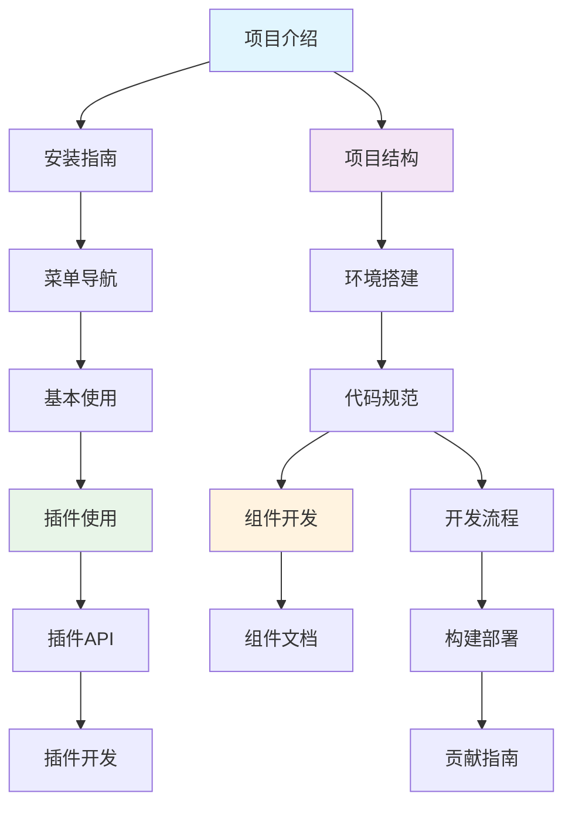

# 📍 文档导航助手

这是一个智能文档导航助手，帮助您快速找到所需的文档。

## 🎯 我想要...

### 📥 安装和使用

<strong>我是新用户，想要安装和使用 Pot</strong>

**推荐路径**:

1. 📖 [项目介绍](README.md) - 了解 Pot 的功能和特色
2. 📥 [安装指南](user-guides/installation.md) - 选择适合您系统的安装方法
3. 🧭 [菜单导航](user-guides/menu-navigation.md) - 熟悉界面和功能
4. 🚀 [基本使用](user-guides/basic-usage.md) - 开始使用翻译功能

**预计时间**: 15-30 分钟

<strong>我遇到了使用问题</strong>

**解决路径**:

1. 🔍 [常见问题](user-guides/troubleshooting.md) - 查找类似问题的解决方案
2. 🧭 [菜单导航](user-guides/menu-navigation.md) - 确认操作步骤是否正确
3. 🔌 [插件使用](user-guides/plugins.md) - 如果是插件相关问题
4. 💬 [获取帮助](#-获取帮助) - 联系社区或提交问题

**预计时间**: 5-15 分钟

### 🔌 插件和扩展

<strong>我想使用或配置插件</strong>

**推荐路径**:

1. 🔌 [插件使用](user-guides/plugins.md) - 了解插件系统和使用方法
2. 🧭 [菜单导航](user-guides/menu-navigation.md) - 找到服务管理页面
3. 🔧 [配置说明](user-guides/configuration.md) - 详细配置步骤
4. 🛠️ [常见问题](user-guides/troubleshooting.md) - 解决配置问题

**预计时间**: 10-20 分钟

<strong>我想开发自己的插件</strong>

**开发路径**:

1. 🔌 [插件使用](user-guides/plugins.md) - 先了解插件的使用
2. 📖 [插件 API](api/plugin-api.md) - 学习插件接口规范
3. 🛠️ [插件开发](development/plugins.md) - 详细开发指南
4. 🤝 [贡献指南](development/contributing.md) - 了解贡献流程

**预计时间**: 2-4 小时

### 💻 开发和贡献

<strong>我想参与 Pot 的开发</strong>

**入门路径**:

1. 🏗️ [项目结构](development/project-structure.md) - 了解项目组织
2. 🚀 [环境搭建](development/development-setup.md) - 配置开发环境
3. 📖 [代码规范](development/coding-standards.md) - 学习编码标准
4. 🔄 [开发流程](development/workflow.md) - 掌握工作流程
5. 🤝 [贡献指南](development/contributing.md) - 开始贡献代码

**预计时间**: 1-2 小时

<strong>我想开发前端组件</strong>

**组件开发路径**:

1. 🎨 [组件中心](components/) - 了解组件系统
2. 🛠️ [组件开发](development/components.md) - 学习开发规范
3. ⚛️ [原子组件](components/atoms/) - 参考基础组件
4. 🧬 [分子组件](components/molecules/) - 学习组件组合
5. 🧪 [测试指南](development/testing.md) - 编写组件测试

**预计时间**: 1-3 小时

<strong>我想集成 Pot 到其他应用</strong>

**集成路径**:

1. 🌐 [外部调用 API](api/external-api.md) - 了解调用接口
2. 🛠️ [开发环境](development/development-setup.md) - 如果需要本地开发
3. 🔧 [配置 API](api/config-api.md) - 配置系统接口
4. 🤝 [贡献指南](development/contributing.md) - 如果想贡献集成代码

**预计时间**: 30 分钟 - 2 小时

## 🔍 按技术栈查找

### 前端技术 (React + TypeScript)

| 技术领域       | 相关文档                                                                            |
| -------------- | ----------------------------------------------------------------------------------- |
| **React 组件** | [组件中心](components/) → [组件开发](development/components.md)                     |
| **状态管理**   | [Hooks 文档](components/hooks/) → [架构设计](development/architecture.md)           |
| **路由系统**   | [路由菜单](development/routes-and-menus.md)                                         |
| **样式系统**   | [组件开发](development/components.md) → [代码规范](development/coding-standards.md) |
| **测试**       | [测试指南](development/testing.md)                                                  |

### 后端技术 (Rust + Tauri)

| 技术领域       | 相关文档                                                                               |
| -------------- | -------------------------------------------------------------------------------------- |
| **Tauri 架构** | [架构设计](development/architecture.md) → [项目结构](development/project-structure.md) |
| **插件系统**   | [插件开发](development/plugins.md) → [插件 API](api/plugin-api.md)                     |
| **构建部署**   | [构建部署](development/build-and-deploy.md)                                            |
| **性能优化**   | [架构设计](development/architecture.md) → [代码规范](development/coding-standards.md)  |

### DevOps 和工具

| 工具类型     | 相关文档                                                                          |
| ------------ | --------------------------------------------------------------------------------- |
| **开发环境** | [环境搭建](development/development-setup.md)                                      |
| **CI/CD**    | [构建部署](development/build-and-deploy.md) → [开发流程](development/workflow.md) |
| **代码质量** | [代码规范](development/coding-standards.md) → [测试指南](development/testing.md)  |
| **项目管理** | [开发流程](development/workflow.md) → [贡献指南](development/contributing.md)     |

## 📚 按文档类型查找

### 📖 教程类文档 (Step-by-step)

-   [安装指南](user-guides/installation.md) - 详细安装步骤
-   [环境搭建](development/development-setup.md) - 开发环境配置
-   [菜单导航](user-guides/menu-navigation.md) - 界面使用教程

### 📋 参考类文档 (Reference)

-   [插件 API](api/plugin-api.md) - 完整 API 参考
-   [外部调用 API](api/external-api.md) - 接口参考文档
-   [组件文档](components/) - UI 组件参考

### 🛠️ 指南类文档 (How-to)

-   [插件开发](development/plugins.md) - 插件开发指南
-   [组件开发](development/components.md) - 组件开发指南
-   [贡献指南](development/contributing.md) - 贡献参与指南

### 🔍 解释类文档 (Explanation)

-   [架构设计](development/architecture.md) - 系统架构解释
-   [项目结构](development/project-structure.md) - 项目组织解释
-   [开发流程](development/workflow.md) - 工作流程解释

## 🎯 按难度级别查找

### 🟢 初级 (新手友好)

-   [项目介绍](README.md)
-   [安装指南](user-guides/installation.md)
-   [菜单导航](user-guides/menu-navigation.md)
-   [插件使用](user-guides/plugins.md)

### 🟡 中级 (需要一定基础)

-   [项目结构](development/project-structure.md)
-   [环境搭建](development/development-setup.md)
-   [组件开发](development/components.md)
-   [外部调用 API](api/external-api.md)

### 🔴 高级 (需要深入理解)

-   [架构设计](development/architecture.md)
-   [插件开发](development/plugins.md)
-   [构建部署](development/build-and-deploy.md)
-   [开发流程](development/workflow.md)

## 🔗 文档关联图

## 🆘 获取帮助

### 📞 联系方式

| 渠道                   | 适用场景           | 链接                                                           |
| ---------------------- | ------------------ | -------------------------------------------------------------- |
| **QQ 频道**            | 实时讨论、使用问题 | [加入频道](https://pd.qq.com/s/akns94e1r)                      |
| **GitHub Issues**      | Bug 报告、功能建议 | [提交 Issue](https://github.com/pot-app/pot-desktop/issues)    |
| **GitHub Discussions** | 技术讨论、经验分享 | [参与讨论](https://github.com/pot-app/pot-desktop/discussions) |
| **文档 PR**            | 文档问题、改进建议 | [提交 PR](https://github.com/pot-app/pot-desktop/pulls)        |

### 🔍 搜索技巧

1. **使用关键词**: 在浏览器中按 `Ctrl+F` 搜索页面内容
2. **GitHub 搜索**: 在项目页面使用 GitHub 的搜索功能
3. **文档标题**: 查看文档标题快速定位内容
4. **目录导航**: 使用文档内的目录链接快速跳转

---

_这个导航助手会根据用户反馈持续优化，帮助您更高效地使用文档。_
