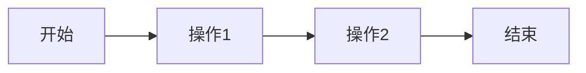
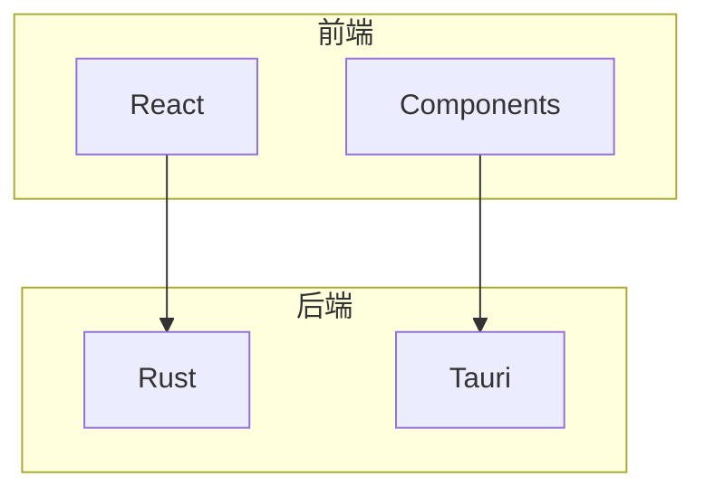

# 📝 文档风格指南

本指南定义了 Pot 项目文档的统一风格、格式规范和编写标准。

## 🎯 文档原则

### 核心理念

1. **用户优先**: 以用户需求为导向组织内容
2. **简洁明了**: 使用清晰、简洁的语言表达
3. **结构化**: 采用一致的结构和格式
4. **可操作**: 提供具体的操作步骤和示例
5. **持续更新**: 保持文档与代码同步更新

### 写作风格

-   **语调**: 友好、专业、有帮助
-   **语言**: 简体中文为主，关键术语保留英文
-   **视角**: 使用第二人称（您）与读者对话
-   **时态**: 使用现在时描述功能和操作

## 📋 文档结构规范

### 标准文档模板

```markdown
# 文档标题

> 📝 简短的文档描述或标语

## 📋 概述

简要介绍文档内容和目的。

### 何时使用

说明什么情况下需要阅读此文档。

## 🔧 主要内容

### 子标题 1

内容描述...

### 子标题 2

内容描述...

## 💡 示例

提供具体的使用示例。

## 🧪 测试/验证

如何验证操作是否成功。

## 🔍 故障排除

常见问题和解决方案。

## 📚 相关文档

-   [相关文档1](link1.md) - 简短描述
-   [相关文档2](link2.md) - 简短描述

---

_文档说明或版权信息_
```

### 标题层级规范

```markdown
# 一级标题 (文档标题)

## 二级标题 (主要章节)

### 三级标题 (子章节)

#### 四级标题 (详细说明)
```

**使用原则**:

-   一级标题：每个文档只有一个
-   二级标题：主要功能模块
-   三级标题：具体功能点
-   四级标题：详细说明（谨慎使用）

## 🎨 格式规范

### Emoji 使用标准

#### 文档类型标识

| Emoji | 用途           | 示例        |
| ----- | -------------- | ----------- |
| 📚    | 文档中心、索引 | 📚 文档中心 |
| 📖    | 指南、教程     | 📖 用户指南 |
| 📋    | 列表、清单     | 📋 检查清单 |
| 🔧    | 配置、设置     | 🔧 配置说明 |
| 🚀    | 快速开始       | 🚀 快速开始 |
| 💡    | 提示、技巧     | 💡 使用技巧 |
| ⚠️    | 警告、注意     | ⚠️ 注意事项 |
| 🔍    | 搜索、查找     | 🔍 快速查找 |

#### 功能分类标识

| Emoji | 功能     | 示例          |
| ----- | -------- | ------------- |
| 🔤    | 翻译功能 | 🔤 翻译设置   |
| 📷    | OCR 识别 | 📷 OCR 配置   |
| 🔊    | 语音功能 | 🔊 TTS 设置   |
| 🔌    | 插件系统 | 🔌 插件管理   |
| ⌨️    | 快捷键   | ⌨️ 快捷键设置 |
| 🌍    | 国际化   | 🌍 多语言支持 |

#### 状态指示

| Emoji | 状态         | 用途          |
| ----- | ------------ | ------------- |
| ✅    | 已完成、推荐 | ✅ 推荐方案   |
| ❌    | 错误、不推荐 | ❌ 避免的做法 |
| 🟢    | 正常、稳定   | 🟢 稳定版本   |
| 🟡    | 警告、开发中 | 🟡 开发中功能 |
| 🔴    | 危险、废弃   | 🔴 已废弃     |

### 表格格式

#### 标准表格

```markdown
| 列标题1 | 列标题2 | 列标题3 |
| ------- | ------- | ------- |
| 内容1   | 内容2   | 内容3   |
| 内容4   | 内容5   | 内容6   |
```

#### 对齐规范

```markdown
| 左对齐 | 居中对齐 | 右对齐 |
| :----- | :------: | -----: |
| 内容   |   内容   |   内容 |
```

### 代码块格式

#### 语言标识

````markdown
```javascript
// JavaScript 代码
const example = 'Hello World';
```
````

```rust
// Rust 代码
fn main() {
    println!("Hello World");
}
```

```bash
# Shell 命令
npm install
```

```json
{
    "配置": "示例"
}
```

````

#### 代码注释规范

```javascript
// ✅ 好的示例
const goodExample = () => {
    // 清晰的注释说明
};

// ❌ 避免的做法
const badExample = () => {
    // 不推荐的实现
};
````

### 链接格式

#### 内部链接

```markdown
-   [文档标题](relative-path.md) - 简短描述
-   [章节标题](document.md#section) - 链接到特定章节
```

#### 外部链接

```markdown
-   [GitHub 项目](https://github.com/pot-app/pot-desktop) - 项目主页
-   [官方网站](https://pot-app.com) - 官方网站
```

#### 图片链接

```markdown


<!-- 带链接的图片 -->

[](https://example.com)
```

## 📊 内容组织规范

### 信息层次

#### 倒金字塔结构

```markdown
## 概述 (最重要的信息)

简要说明文档主要内容

## 详细说明 (支撑信息)

详细的操作步骤和配置方法

## 高级用法 (补充信息)

高级功能和自定义选项

## 故障排除 (辅助信息)

常见问题和解决方案
```

#### 渐进式披露

```markdown
## 基础功能

基本功能说明

<details>
<summary><strong>高级选项</strong></summary>

高级功能的详细说明

</details>
```

### 代码示例规范

#### 完整示例

```javascript
// ✅ 完整的代码示例
import React, { useState } from 'react';
import { Button, Input } from '@nextui-org/react';

const TranslationForm = () => {
    const [text, setText] = useState('');

    const handleTranslate = async () => {
        try {
            const result = await translateText(text);
            console.log('Translation result:', result);
        } catch (error) {
            console.error('Translation failed:', error);
        }
    };

    return (
        <div className='space-y-4'>
            <Input
                value={text}
                onValueChange={setText}
                placeholder='输入要翻译的文本'
            />
            <Button onClick={handleTranslate}>翻译</Button>
        </div>
    );
};

export default TranslationForm;
```

#### 代码片段

```javascript
// 简短的代码片段
const handleClick = () => {
    console.log('Button clicked');
};
```

### 列表格式

#### 有序列表

```markdown
1. **第一步**: 具体操作说明
2. **第二步**: 具体操作说明
3. **第三步**: 具体操作说明
```

#### 无序列表

```markdown
-   **重要项目**: 详细说明
-   **次要项目**: 详细说明
-   **可选项目**: 详细说明
```

#### 任务清单

```markdown
-   [x] 已完成的任务
-   [ ] 待完成的任务
-   [ ] 计划中的任务
```

## 🔤 语言规范

### 术语使用

#### 技术术语

| 中文术语 | 英文术语        | 使用场景 |
| -------- | --------------- | -------- |
| 翻译     | Translation     | 功能描述 |
| 识别     | Recognition/OCR | OCR 功能 |
| 插件     | Plugin          | 扩展功能 |
| 配置     | Configuration   | 设置相关 |
| 快捷键   | Hotkey/Shortcut | 键盘操作 |

#### 保留英文的术语

-   **API** (不翻译为"应用程序接口")
-   **JSON** (不翻译为"数据格式")
-   **HTTP** (不翻译为"超文本传输协议")
-   **URL** (不翻译为"统一资源定位符")
-   **Git** (版本控制工具名称)

### 语言风格

#### 推荐用法

```markdown
✅ 您可以通过以下步骤配置翻译服务...
✅ 点击"设置"按钮打开配置页面
✅ 建议使用 Google 翻译获得更好的效果
```

#### 避免用法

```markdown
❌ 你可以...（使用"您"而不是"你"）
❌ 我们建议...（避免第一人称）
❌ 这个功能很强大...（避免主观评价）
```

### 标点符号

#### 中文标点

-   使用中文标点：，。！？：；""''
-   英文术语后使用中文标点：API，JSON，HTTP。

#### 英文标点

-   代码中使用英文标点
-   URL 和文件路径使用英文标点

## 🖼️ 视觉元素

### 流程图



### 架构图



### 提示框

#### 信息提示

> 💡 **提示**: 这是一个有用的信息

#### 警告提示

> ⚠️ **注意**: 这是需要注意的事项

#### 重要提示

> 🚨 **重要**: 这是非常重要的信息

## 📝 编写检查清单

### 内容检查

-   [ ] 标题清晰且具有描述性
-   [ ] 概述部分简洁明了
-   [ ] 内容结构逻辑清晰
-   [ ] 代码示例完整可运行
-   [ ] 链接地址正确有效
-   [ ] 图片显示正常
-   [ ] 语法和拼写正确

### 格式检查

-   [ ] 使用正确的 Markdown 语法
-   [ ] Emoji 使用符合规范
-   [ ] 表格格式整齐
-   [ ] 代码块有语言标识
-   [ ] 列表格式一致
-   [ ] 标点符号使用正确

### 风格检查

-   [ ] 语言风格统一
-   [ ] 术语使用一致
-   [ ] 信息层次清晰
-   [ ] 视觉元素适当
-   [ ] 交互元素有效

## 🔧 工具和辅助

### Markdown 编辑器

推荐使用以下编辑器：

-   **Typora** - 所见即所得编辑器
-   **Mark Text** - 开源 Markdown 编辑器
-   **VS Code** + Markdown 扩展
-   **Obsidian** - 知识管理工具

### 格式化工具

```bash
# 安装 Prettier 用于 Markdown 格式化
npm install -g prettier

# 格式化 Markdown 文件
prettier --write "docs/**/*.md"

# 检查格式
prettier --check "docs/**/*.md"
```

### 链接检查

```bash
# 安装链接检查工具
npm install -g markdown-link-check

# 检查文档中的链接
markdown-link-check docs/README.md

# 批量检查所有文档
find docs -name "*.md" -exec markdown-link-check {} \;
```

## 📊 文档质量评估

### 评估维度

| 维度         | 评估标准         | 权重 |
| ------------ | ---------------- | ---- |
| **完整性**   | 内容覆盖是否全面 | 30%  |
| **准确性**   | 信息是否正确最新 | 25%  |
| **可用性**   | 是否易于理解使用 | 20%  |
| **一致性**   | 格式风格是否统一 | 15%  |
| **可维护性** | 是否易于更新维护 | 10%  |

### 质量检查清单

#### 内容质量

-   [ ] 信息准确且最新
-   [ ] 覆盖所有必要内容
-   [ ] 示例代码可运行
-   [ ] 步骤说明清晰
-   [ ] 解决实际问题

#### 结构质量

-   [ ] 逻辑结构清晰
-   [ ] 导航路径明确
-   [ ] 交叉引用正确
-   [ ] 分类组织合理
-   [ ] 搜索友好

#### 表达质量

-   [ ] 语言简洁明了
-   [ ] 术语使用一致
-   [ ] 语法拼写正确
-   [ ] 风格统一专业
-   [ ] 用户友好

## 🔄 文档维护

### 更新频率

-   **重要文档**: 每次功能更新后及时更新
-   **API 文档**: 与代码同步更新
-   **用户指南**: 每月检查一次
-   **开发文档**: 每季度全面审查

### 版本控制

```markdown
## <!-- 在文档末尾添加版本信息 -->

_文档版本: v3.0.7 | 最后更新: 2024年12月 | 维护者: Pot Team_
```

### 反馈收集

-   **GitHub Issues**: 收集文档问题报告
-   **Pull Requests**: 接受文档改进建议
-   **用户调研**: 定期收集用户反馈
-   **数据分析**: 分析文档访问数据

## 📚 参考资源

### 写作指南

-   [中文文案排版指北](https://github.com/sparanoid/chinese-copywriting-guidelines)
-   [Markdown 语法指南](https://www.markdownguide.org/)
-   [技术写作最佳实践](https://developers.google.com/tech-writing)

### 工具资源

-   [Mermaid 图表语法](https://mermaid-js.github.io/)
-   [Emoji 参考](https://emojipedia.org/)
-   [Markdown 在线编辑器](https://stackedit.io/)

---

_本风格指南是 Pot 项目文档质量的重要保障，所有文档贡献者都应遵循此指南。_
