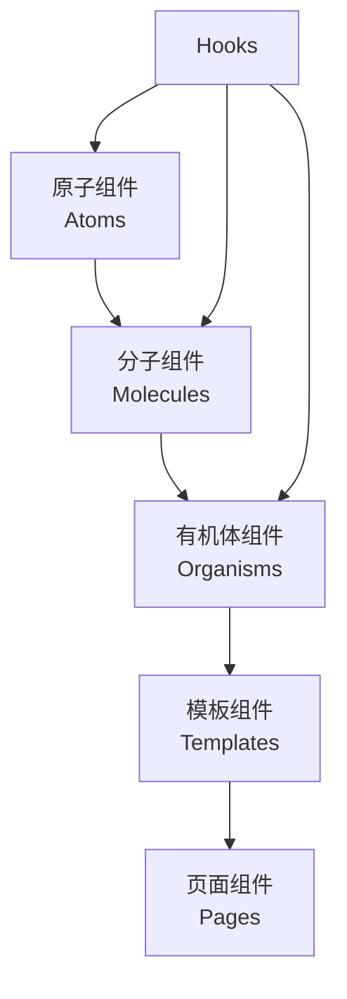

# 组件文档中心

欢迎来到 Pot 组件文档中心！这里包含了项目中所有 UI 组件的详细文档。

## 🎨 组件架构

Pot 采用原子设计系统 (Atomic Design) 组织组件，确保组件的可复用性和一致性。

### 组件分层



## 📚 组件分类

### ⚛️ 原子组件 (Atoms)

最小的 UI 构建块，不可再分解的基础组件。

-   [Button](atoms/Button.md) - 按钮组件
-   [Input](atoms/Input.md) - 输入框组件
-   [Text](atoms/Text.md) - 文本组件
-   [Icon](atoms/Icon.md) - 图标组件
-   [Switch](atoms/Switch.md) - 开关组件
-   [Chip](atoms/Chip.md) - 标签组件

### 🧬 分子组件 (Molecules)

由原子组件组合而成，具有特定功能的组件。

-   [LanguageSelect](molecules/LanguageSelect.md) - 语言选择器
-   [ServiceCard](molecules/ServiceCard.md) - 服务卡片
-   [SearchBox](molecules/SearchBox.md) - 搜索框
-   [ConfigItem](molecules/ConfigItem.md) - 配置项组件
-   [ToolbarButton](molecules/ToolbarButton.md) - 工具栏按钮

### 🦠 有机体组件 (Organisms)

复杂的 UI 模块，包含完整的功能逻辑。

-   [TranslationPanel](organisms/TranslationPanel.md) - 翻译面板
-   [RecognitionPanel](organisms/RecognitionPanel.md) - 识别面板
-   [SettingsForm](organisms/SettingsForm.md) - 设置表单
-   [HistoryList](organisms/HistoryList.md) - 历史记录列表
-   [ServiceList](organisms/ServiceList.md) - 服务列表

### 📋 模板组件 (Templates)

页面布局模板，定义页面结构。

-   [MainLayout](templates/MainLayout.md) - 主布局模板
-   [ConfigLayout](templates/ConfigLayout.md) - 配置页面布局
-   [DialogLayout](templates/DialogLayout.md) - 对话框布局

### 🎣 Hooks

自定义 React Hooks，提供可复用的逻辑。

-   [useConfig](hooks/useConfig.md) - 配置管理 Hook
-   [useTranslation](hooks/useTranslation.md) - 翻译服务 Hook
-   [useClipboard](hooks/useClipboard.md) - 剪贴板操作 Hook
-   [useHotkey](hooks/useHotkey.md) - 快捷键绑定 Hook
-   [useTheme](hooks/useTheme.md) - 主题管理 Hook

## 🔍 快速查找

### 按功能分类

| 功能类别     | 相关组件                          |
| ------------ | --------------------------------- |
| **文本输入** | Input, SearchBox, TextArea        |
| **操作按钮** | Button, ToolbarButton, IconButton |
| **选择器**   | LanguageSelect, Select, Switch    |
| **显示组件** | Text, Chip, Badge, Avatar         |
| **布局组件** | Card, Panel, Layout, Grid         |
| **反馈组件** | Toast, Modal, Loading, Progress   |

### 按使用场景

| 使用场景     | 推荐组件                                   |
| ------------ | ------------------------------------------ |
| **翻译功能** | TranslationPanel, LanguageSelect, TextArea |
| **设置配置** | SettingsForm, ConfigItem, Switch           |
| **服务管理** | ServiceCard, ServiceList, StatusIndicator  |
| **历史记录** | HistoryList, SearchBox, FilterSelect       |
| **用户反馈** | Toast, Modal, ConfirmDialog                |

## 🛠️ 开发指南

### 新组件开发

1. **确定组件层级**: 根据功能复杂度选择合适的层级
2. **设计 API**: 定义清晰的属性接口
3. **实现组件**: 遵循项目代码规范
4. **编写测试**: 添加单元测试和集成测试
5. **编写文档**: 使用统一的文档模板
6. **添加故事**: 创建 Storybook 故事

### 组件文档模板

每个组件文档应包含以下部分：

1. **概述**: 组件功能和用途
2. **API**: 属性列表和类型定义
3. **示例**: 基础用法和高级用法
4. **样式**: 样式变体和自定义
5. **可访问性**: 无障碍使用说明
6. **测试**: 测试策略和示例

### 文档编写规范

-   使用 Markdown 格式
-   包含代码示例和效果图
-   提供 TypeScript 类型定义
-   说明可访问性特性
-   添加使用注意事项

## 🎨 设计系统

### 设计原则

1. **一致性**: 统一的视觉风格和交互模式
2. **可用性**: 易于理解和使用
3. **可访问性**: 支持无障碍访问
4. **响应式**: 适配不同屏幕尺寸
5. **性能**: 优化渲染性能

### 主题系统

-   **浅色主题**: 适合日间使用
-   **深色主题**: 适合夜间使用
-   **跟随系统**: 自动切换主题
-   **自定义主题**: 支持用户自定义

### 色彩规范

| 颜色类型      | 用途           | 示例               |
| ------------- | -------------- | ------------------ |
| **Primary**   | 主要操作和强调 | 翻译按钮、主要链接 |
| **Secondary** | 次要操作       | 取消按钮、辅助功能 |
| **Success**   | 成功状态       | 翻译成功、保存完成 |
| **Warning**   | 警告状态       | 配置警告、注意事项 |
| **Danger**    | 错误状态       | 错误信息、删除操作 |

## 📊 组件使用统计

### 最常用组件

1. **Button** - 90% 页面使用
2. **Input** - 80% 页面使用
3. **Card** - 70% 页面使用
4. **Text** - 95% 页面使用
5. **Icon** - 85% 页面使用

### 复杂度分布

-   **简单组件 (1-2 个属性)**: 40%
-   **中等组件 (3-8 个属性)**: 45%
-   **复杂组件 (9+ 个属性)**: 15%

## 🔧 开发工具

### Storybook

查看和测试组件的交互式文档：

```bash
# 启动 Storybook
pnpm storybook

# 构建 Storybook
pnpm build-storybook
```

### 组件测试

```bash
# 运行组件测试
pnpm test:components

# 运行视觉回归测试
pnpm test:visual

# 生成测试覆盖率报告
pnpm test:coverage
```

### 组件分析

```bash
# 分析组件依赖
pnpm analyze:components

# 检查组件使用情况
pnpm audit:components

# 生成组件文档
pnpm docs:generate
```

## 📋 贡献指南

### 添加新组件

1. **创建组件文件**: 在对应目录创建组件
2. **编写测试**: 添加单元测试和集成测试
3. **创建故事**: 添加 Storybook 故事
4. **编写文档**: 使用文档模板编写说明
5. **更新索引**: 在本文档中添加链接

### 改进现有组件

1. **提交 Issue**: 描述改进建议
2. **讨论方案**: 与团队讨论实现方案
3. **实现改进**: 遵循向后兼容原则
4. **更新文档**: 同步更新相关文档
5. **提交 PR**: 提交代码审查

## 🤝 社区参与

### 贡献方式

-   **报告问题**: 发现组件 Bug 或可用性问题
-   **提出建议**: 建议新组件或改进现有组件
-   **贡献代码**: 实现新组件或修复问题
-   **完善文档**: 改进组件文档和示例
-   **设计支持**: 提供设计建议和资源

### 获取帮助

-   **GitHub Issues**: [提交问题](https://github.com/pot-app/pot-desktop/issues)
-   **GitHub Discussions**: [参与讨论](https://github.com/pot-app/pot-desktop/discussions)
-   **QQ 频道**: [加入社区](https://pd.qq.com/s/akns94e1r)

## 📚 相关资源

### 设计系统

-   [NextUI 文档](https://nextui.org/) - 基础 UI 组件库
-   [TailwindCSS 文档](https://tailwindcss.com/) - 样式框架
-   [Headless UI](https://headlessui.com/) - 无头 UI 组件

### 开发工具

-   [React 文档](https://react.dev/) - React 官方文档
-   [Storybook 文档](https://storybook.js.org/) - 组件开发工具
-   [Testing Library](https://testing-library.com/) - 测试工具

### 设计参考

-   [Material Design](https://material.io/) - Google 设计系统
-   [Human Interface Guidelines](https://developer.apple.com/design/) - Apple 设计指南
-   [Fluent Design](https://www.microsoft.com/design/fluent/) - Microsoft 设计系统

---

_组件文档会随着项目发展持续更新，欢迎贡献新的组件和改进建议。_
