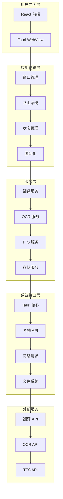
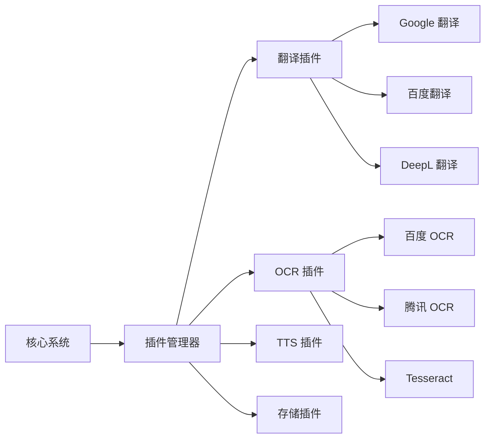
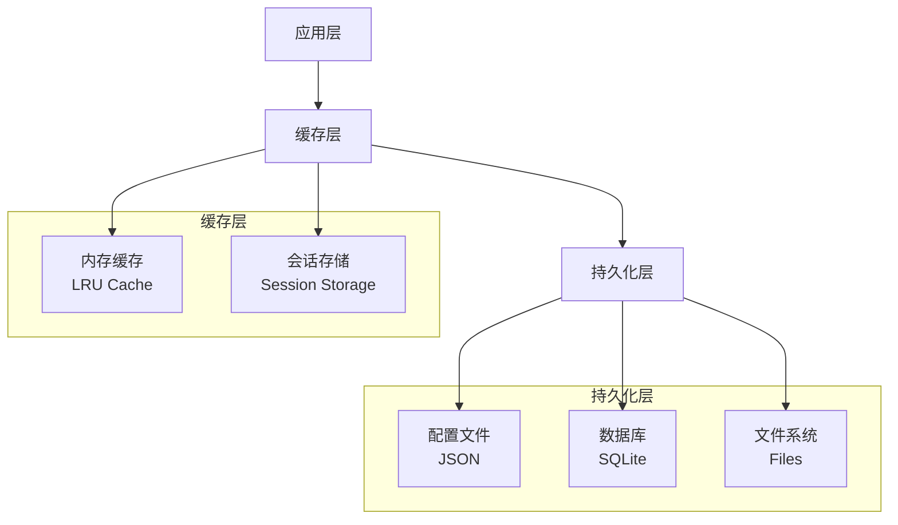

# 系统架构设计

本文档详细描述了 Pot 项目的系统架构、设计理念和技术决策。

## 🏗️ 整体架构

### 架构概览



### 技术栈选择

#### 前端技术栈

| 技术             | 版本 | 选择理由                   |
| ---------------- | ---- | -------------------------- |
| **React**        | 18.x | 成熟的组件化框架，生态丰富 |
| **Vite**         | 5.x  | 快速的构建工具，开发体验好 |
| **TailwindCSS**  | 3.x  | 原子化 CSS，快速开发       |
| **NextUI**       | 2.x  | 现代化 UI 组件库           |
| **Jotai**        | 2.x  | 轻量级状态管理             |
| **React Router** | 6.x  | 标准路由解决方案           |
| **i18next**      | 23.x | 完善的国际化支持           |

#### 后端技术栈

| 技术        | 版本  | 选择理由           |
| ----------- | ----- | ------------------ |
| **Rust**    | 1.70+ | 内存安全，性能优秀 |
| **Tauri**   | 1.x   | 跨平台桌面应用框架 |
| **Tokio**   | 1.x   | 异步运行时         |
| **Serde**   | 1.x   | 序列化/反序列化    |
| **Reqwest** | 0.11  | HTTP 客户端        |
| **SQLite**  | -     | 轻量级数据库       |

## 🎯 设计原则

### 核心原则

1. **模块化设计**: 高内聚、低耦合的模块结构
2. **插件化架构**: 支持功能扩展和定制
3. **异步优先**: 避免阻塞用户界面
4. **错误处理**: 完善的错误处理和恢复机制
5. **性能优化**: 响应速度和资源使用优化
6. **安全第一**: 数据安全和隐私保护
7. **跨平台兼容**: 统一的跨平台体验

### 架构模式

#### 1. 分层架构 (Layered Architecture)

```
┌─────────────────────────────────────┐
│           表示层 (UI Layer)          │
│  React Components, Hooks, Styles   │
├─────────────────────────────────────┤
│         应用层 (App Layer)          │
│   Routing, State Management, i18n  │
├─────────────────────────────────────┤
│        服务层 (Service Layer)       │
│   Translation, OCR, TTS, Storage   │
├─────────────────────────────────────┤
│       基础设施层 (Infra Layer)      │
│   Tauri APIs, File System, Network │
└─────────────────────────────────────┘
```

#### 2. 插件架构 (Plugin Architecture)



#### 3. 事件驱动架构 (Event-Driven)

```javascript
// 事件系统设计
class EventBus {
    constructor() {
        this.events = new Map();
    }

    on(event, callback) {
        if (!this.events.has(event)) {
            this.events.set(event, []);
        }
        this.events.get(event).push(callback);
    }

    emit(event, data) {
        if (this.events.has(event)) {
            this.events.get(event).forEach((callback) => callback(data));
        }
    }
}

// 使用示例
eventBus.on('translation:completed', (result) => {
    // 更新 UI
    // 保存历史
    // 发送通知
});
```

## 🔧 核心模块设计

### 1. 窗口管理系统

#### 窗口类型

```rust
// src-tauri/src/window.rs
#[derive(Debug, Clone)]
pub enum WindowType {
    Config,      // 配置窗口
    Translate,   // 翻译窗口
    Recognize,   // 识别窗口
    Screenshot,  // 截图窗口
    Updater,     // 更新窗口
}

pub struct WindowManager {
    windows: HashMap<WindowType, Window>,
}

impl WindowManager {
    pub fn create_window(&mut self, window_type: WindowType) -> Result<()> {
        let config = self.get_window_config(&window_type);
        let window = WindowBuilder::new()
            .title(&config.title)
            .inner_size(config.size)
            .resizable(config.resizable)
            .decorations(config.decorations)
            .build()?;

        self.windows.insert(window_type, window);
        Ok(())
    }

    pub fn show_window(&self, window_type: &WindowType) -> Result<()> {
        if let Some(window) = self.windows.get(window_type) {
            window.show()?;
        }
        Ok(())
    }
}
```

### 2. 服务管理系统

#### 服务抽象

```rust
// src-tauri/src/services/mod.rs
#[async_trait]
pub trait TranslationService: Send + Sync {
    async fn translate(
        &self,
        text: &str,
        from: &str,
        to: &str,
    ) -> Result<TranslationResult, ServiceError>;

    fn get_supported_languages(&self) -> Vec<Language>;
    fn get_service_info(&self) -> ServiceInfo;
}

pub struct ServiceManager {
    translation_services: Vec<Box<dyn TranslationService>>,
    ocr_services: Vec<Box<dyn OcrService>>,
    tts_services: Vec<Box<dyn TtsService>>,
}

impl ServiceManager {
    pub async fn translate_with_fallback(
        &self,
        text: &str,
        from: &str,
        to: &str,
    ) -> Result<TranslationResult, ServiceError> {
        for service in &self.translation_services {
            match service.translate(text, from, to).await {
                Ok(result) => return Ok(result),
                Err(e) => {
                    log::warn!("Service failed: {}, trying next", e);
                    continue;
                }
            }
        }
        Err(ServiceError::AllServicesFailed)
    }
}
```

### 3. 配置管理系统

#### 配置架构

```rust
// src-tauri/src/config.rs
use serde::{Deserialize, Serialize};

#[derive(Debug, Clone, Serialize, Deserialize)]
pub struct AppConfig {
    pub general: GeneralConfig,
    pub translation: TranslationConfig,
    pub recognition: RecognitionConfig,
    pub hotkeys: HotkeyConfig,
    pub services: ServicesConfig,
}

#[derive(Debug, Clone, Serialize, Deserialize)]
pub struct GeneralConfig {
    pub language: String,
    pub theme: String,
    pub font_family: String,
    pub font_size: u16,
    pub auto_start: bool,
    pub check_update: bool,
}

pub struct ConfigManager {
    config: AppConfig,
    config_path: PathBuf,
    watchers: Vec<Box<dyn ConfigWatcher>>,
}

impl ConfigManager {
    pub fn load() -> Result<Self, ConfigError> {
        let config_path = Self::get_config_path()?;
        let config = if config_path.exists() {
            let content = fs::read_to_string(&config_path)?;
            serde_json::from_str(&content)?
        } else {
            AppConfig::default()
        };

        Ok(Self {
            config,
            config_path,
            watchers: Vec::new(),
        })
    }

    pub fn save(&self) -> Result<(), ConfigError> {
        let content = serde_json::to_string_pretty(&self.config)?;
        fs::write(&self.config_path, content)?;

        // 通知所有观察者
        for watcher in &self.watchers {
            watcher.on_config_changed(&self.config);
        }

        Ok(())
    }
}
```

### 4. 状态管理系统

#### 前端状态管理

```javascript
// src/store/atoms.js
import { atom } from 'jotai';

// 全局状态原子
export const configAtom = atom({
    language: 'en',
    theme: 'system',
    fontSize: 16,
});

export const translationAtom = atom({
    sourceText: '',
    targetText: '',
    sourceLanguage: 'auto',
    targetLanguage: 'zh',
    isLoading: false,
});

export const historyAtom = atom([]);

// 派生状态
export const currentThemeAtom = atom((get) => {
    const config = get(configAtom);
    if (config.theme === 'system') {
        return window.matchMedia('(prefers-color-scheme: dark)').matches ? 'dark' : 'light';
    }
    return config.theme;
});

// 异步状态
export const translateTextAtom = atom(null, async (get, set, { text, from, to }) => {
    set(translationAtom, (prev) => ({ ...prev, isLoading: true }));

    try {
        const result = await translateApi.translate(text, from, to);
        set(translationAtom, (prev) => ({
            ...prev,
            targetText: result,
            isLoading: false,
        }));

        // 添加到历史记录
        set(historyAtom, (prev) => [
            { text, result, from, to, timestamp: Date.now() },
            ...prev.slice(0, 99), // 保留最近 100 条
        ]);
    } catch (error) {
        set(translationAtom, (prev) => ({
            ...prev,
            isLoading: false,
            error: error.message,
        }));
    }
});
```

## 🔌 插件系统架构

### 插件接口设计

```typescript
// src/types/plugin.ts
export interface PluginManifest {
    name: string;
    version: string;
    description: string;
    author: string;
    homepage?: string;
    keywords: string[];
    engines: {
        pot: string;
    };
}

export interface TranslationPlugin {
    manifest: PluginManifest;
    translate(params: TranslationParams): Promise<TranslationResult>;
    getSupportedLanguages(): Language[];
    validateConfig(config: any): boolean;
}

export interface OcrPlugin {
    manifest: PluginManifest;
    recognize(image: ImageData): Promise<OcrResult>;
    getSupportedLanguages(): Language[];
    validateConfig(config: any): boolean;
}
```

### 插件加载机制

```rust
// src-tauri/src/plugin/loader.rs
pub struct PluginLoader {
    plugin_dir: PathBuf,
    loaded_plugins: HashMap<String, Box<dyn Plugin>>,
}

impl PluginLoader {
    pub fn load_plugins(&mut self) -> Result<(), PluginError> {
        let plugin_files = fs::read_dir(&self.plugin_dir)?;

        for entry in plugin_files {
            let path = entry?.path();
            if path.extension() == Some(OsStr::new("wasm")) {
                self.load_wasm_plugin(&path)?;
            } else if path.extension() == Some(OsStr::new("js")) {
                self.load_js_plugin(&path)?;
            }
        }

        Ok(())
    }

    fn load_wasm_plugin(&mut self, path: &Path) -> Result<(), PluginError> {
        let bytes = fs::read(path)?;
        let module = wasmtime::Module::new(&self.engine, &bytes)?;
        let instance = wasmtime::Instance::new(&mut self.store, &module, &[])?;

        // 创建插件包装器
        let plugin = WasmPlugin::new(instance);
        let manifest = plugin.get_manifest()?;

        self.loaded_plugins.insert(manifest.name.clone(), Box::new(plugin));
        Ok(())
    }
}
```

## 🌐 网络架构

### HTTP 客户端设计

```rust
// src-tauri/src/network/client.rs
pub struct HttpClient {
    client: reqwest::Client,
    config: NetworkConfig,
}

impl HttpClient {
    pub fn new(config: NetworkConfig) -> Self {
        let mut builder = reqwest::Client::builder()
            .timeout(Duration::from_secs(config.timeout))
            .user_agent("Pot/3.0.7");

        // 配置代理
        if let Some(proxy_url) = &config.proxy_url {
            if let Ok(proxy) = reqwest::Proxy::all(proxy_url) {
                builder = builder.proxy(proxy);
            }
        }

        // 配置 TLS
        builder = builder
            .danger_accept_invalid_certs(config.accept_invalid_certs)
            .use_rustls_tls();

        let client = builder.build().unwrap();

        Self { client, config }
    }

    pub async fn post_json<T, R>(
        &self,
        url: &str,
        body: &T,
    ) -> Result<R, NetworkError>
    where
        T: Serialize,
        R: for<'de> Deserialize<'de>,
    {
        let response = self
            .client
            .post(url)
            .json(body)
            .send()
            .await?;

        if response.status().is_success() {
            let result = response.json().await?;
            Ok(result)
        } else {
            Err(NetworkError::HttpError(response.status()))
        }
    }
}
```

### 请求重试机制

```rust
// src-tauri/src/network/retry.rs
pub struct RetryPolicy {
    max_attempts: u32,
    base_delay: Duration,
    max_delay: Duration,
    backoff_factor: f64,
}

impl RetryPolicy {
    pub async fn execute<F, T, E>(&self, mut operation: F) -> Result<T, E>
    where
        F: FnMut() -> Pin<Box<dyn Future<Output = Result<T, E>>>>,
        E: std::fmt::Debug,
    {
        let mut attempts = 0;
        let mut delay = self.base_delay;

        loop {
            attempts += 1;

            match operation().await {
                Ok(result) => return Ok(result),
                Err(error) => {
                    if attempts >= self.max_attempts {
                        return Err(error);
                    }

                    log::warn!("Attempt {} failed: {:?}, retrying in {:?}",
                              attempts, error, delay);

                    tokio::time::sleep(delay).await;
                    delay = std::cmp::min(
                        Duration::from_millis(
                            (delay.as_millis() as f64 * self.backoff_factor) as u64
                        ),
                        self.max_delay,
                    );
                }
            }
        }
    }
}
```

## 💾 数据架构

### 数据存储策略

#### 存储分层



#### 数据模型

```rust
// src-tauri/src/models/mod.rs
use serde::{Deserialize, Serialize};
use chrono::{DateTime, Utc};

#[derive(Debug, Clone, Serialize, Deserialize)]
pub struct TranslationRecord {
    pub id: String,
    pub source_text: String,
    pub target_text: String,
    pub source_language: String,
    pub target_language: String,
    pub service: String,
    pub timestamp: DateTime<Utc>,
    pub is_favorite: bool,
}

#[derive(Debug, Clone, Serialize, Deserialize)]
pub struct OcrRecord {
    pub id: String,
    pub image_path: String,
    pub recognized_text: String,
    pub language: String,
    pub confidence: f32,
    pub service: String,
    pub timestamp: DateTime<Utc>,
}

#[derive(Debug, Clone, Serialize, Deserialize)]
pub struct UserConfig {
    pub version: String,
    pub general: GeneralConfig,
    pub services: HashMap<String, serde_json::Value>,
    pub hotkeys: HashMap<String, String>,
    pub ui: UiConfig,
}
```

### 数据库设计

#### 表结构

```sql
-- 翻译历史表
CREATE TABLE translation_history (
    id TEXT PRIMARY KEY,
    source_text TEXT NOT NULL,
    target_text TEXT NOT NULL,
    source_language TEXT NOT NULL,
    target_language TEXT NOT NULL,
    service TEXT NOT NULL,
    timestamp INTEGER NOT NULL,
    is_favorite BOOLEAN DEFAULT FALSE,
    tags TEXT, -- JSON 数组
    created_at DATETIME DEFAULT CURRENT_TIMESTAMP
);

-- OCR 历史表
CREATE TABLE ocr_history (
    id TEXT PRIMARY KEY,
    image_hash TEXT NOT NULL,
    recognized_text TEXT NOT NULL,
    language TEXT NOT NULL,
    confidence REAL NOT NULL,
    service TEXT NOT NULL,
    timestamp INTEGER NOT NULL,
    created_at DATETIME DEFAULT CURRENT_TIMESTAMP
);

-- 用户收藏表
CREATE TABLE user_favorites (
    id TEXT PRIMARY KEY,
    content TEXT NOT NULL,
    content_type TEXT NOT NULL, -- 'translation' or 'ocr'
    reference_id TEXT NOT NULL,
    tags TEXT, -- JSON 数组
    notes TEXT,
    created_at DATETIME DEFAULT CURRENT_TIMESTAMP
);

-- 创建索引
CREATE INDEX idx_translation_timestamp ON translation_history(timestamp);
CREATE INDEX idx_translation_language ON translation_history(source_language, target_language);
CREATE INDEX idx_ocr_timestamp ON ocr_history(timestamp);
CREATE INDEX idx_favorites_type ON user_favorites(content_type);
```

## 🔒 安全架构

### 安全设计原则

1. **最小权限原则**: 只请求必要的系统权限
2. **数据加密**: 敏感数据加密存储
3. **网络安全**: HTTPS 通信，证书验证
4. **输入验证**: 严格的输入验证和清理
5. **错误处理**: 不泄露敏感信息的错误处理

### 安全实现

#### 敏感数据加密

```rust
// src-tauri/src/security/crypto.rs
use aes_gcm::{Aes256Gcm, Key, Nonce};
use aes_gcm::aead::{Aead, NewAead};
use rand::Rng;

pub struct SecureStorage {
    cipher: Aes256Gcm,
}

impl SecureStorage {
    pub fn new(password: &str) -> Result<Self, CryptoError> {
        let key = Self::derive_key(password)?;
        let cipher = Aes256Gcm::new(&key);
        Ok(Self { cipher })
    }

    pub fn encrypt(&self, data: &str) -> Result<String, CryptoError> {
        let nonce = Nonce::from_slice(&rand::thread_rng().gen::<[u8; 12]>());
        let ciphertext = self.cipher.encrypt(nonce, data.as_bytes())?;

        let mut result = nonce.to_vec();
        result.extend_from_slice(&ciphertext);
        Ok(base64::encode(result))
    }

    pub fn decrypt(&self, encrypted_data: &str) -> Result<String, CryptoError> {
        let data = base64::decode(encrypted_data)?;
        let (nonce, ciphertext) = data.split_at(12);

        let plaintext = self.cipher.decrypt(
            Nonce::from_slice(nonce),
            ciphertext
        )?;

        Ok(String::from_utf8(plaintext)?)
    }

    fn derive_key(password: &str) -> Result<Key, CryptoError> {
        // 使用 PBKDF2 派生密钥
        // 实现细节...
        todo!()
    }
}
```

#### 网络安全

```rust
// src-tauri/src/network/security.rs
pub struct SecureHttpClient {
    client: reqwest::Client,
    certificate_pins: HashMap<String, Vec<String>>,
}

impl SecureHttpClient {
    pub fn new() -> Result<Self, NetworkError> {
        let client = reqwest::Client::builder()
            .use_rustls_tls()
            .https_only(true)
            .timeout(Duration::from_secs(30))
            .build()?;

        Ok(Self {
            client,
            certificate_pins: Self::load_certificate_pins(),
        })
    }

    pub async fn request(&self, request: Request) -> Result<Response, NetworkError> {
        // 验证证书指纹
        if let Some(pins) = self.certificate_pins.get(&request.host()) {
            self.verify_certificate_pin(&request, pins)?;
        }

        // 发送请求
        let response = self.client.execute(request).await?;

        // 验证响应
        self.validate_response(&response)?;

        Ok(response)
    }
}
```

## 📱 跨平台架构

### 平台抽象层

```rust
// src-tauri/src/platform/mod.rs
#[cfg(target_os = "windows")]
mod windows;
#[cfg(target_os = "macos")]
mod macos;
#[cfg(target_os = "linux")]
mod linux;

pub trait PlatformInterface {
    fn get_system_language() -> String;
    fn get_clipboard_text() -> Result<String, PlatformError>;
    fn set_clipboard_text(text: &str) -> Result<(), PlatformError>;
    fn show_notification(title: &str, body: &str) -> Result<(), PlatformError>;
    fn capture_screenshot(area: ScreenArea) -> Result<ImageData, PlatformError>;
    fn register_global_hotkey(hotkey: &str, callback: Box<dyn Fn()>) -> Result<(), PlatformError>;
}

#[cfg(target_os = "windows")]
pub use windows::WindowsPlatform as Platform;
#[cfg(target_os = "macos")]
pub use macos::MacOSPlatform as Platform;
#[cfg(target_os = "linux")]
pub use linux::LinuxPlatform as Platform;
```

### 平台特定实现

#### Windows 实现

```rust
// src-tauri/src/platform/windows.rs
use windows::Win32::UI::WindowsAndMessaging::*;
use windows::Win32::Foundation::*;

pub struct WindowsPlatform;

impl PlatformInterface for WindowsPlatform {
    fn get_clipboard_text() -> Result<String, PlatformError> {
        unsafe {
            if OpenClipboard(HWND(0)).is_ok() {
                let handle = GetClipboardData(CF_UNICODETEXT.0);
                if !handle.is_invalid() {
                    let ptr = GlobalLock(handle) as *const u16;
                    let text = U16CStr::from_ptr_str(ptr).to_string_lossy();
                    GlobalUnlock(handle);
                    CloseClipboard();
                    return Ok(text);
                }
                CloseClipboard();
            }
        }
        Err(PlatformError::ClipboardError)
    }

    fn capture_screenshot(area: ScreenArea) -> Result<ImageData, PlatformError> {
        // Windows 截图实现
        // 使用 GDI+ 或 Windows Runtime API
        todo!()
    }
}
```

#### macOS 实现

```rust
// src-tauri/src/platform/macos.rs
use objc::runtime::*;
use objc::{msg_send, sel, sel_impl};

pub struct MacOSPlatform;

impl PlatformInterface for MacOSPlatform {
    fn get_clipboard_text() -> Result<String, PlatformError> {
        unsafe {
            let pasteboard: *mut Object = msg_send![class!(NSPasteboard), generalPasteboard];
            let string: *mut Object = msg_send![pasteboard, stringForType: NSPasteboardTypeString];

            if !string.is_null() {
                let cstr: *const i8 = msg_send![string, UTF8String];
                let text = std::ffi::CStr::from_ptr(cstr).to_string_lossy().into_owned();
                Ok(text)
            } else {
                Err(PlatformError::ClipboardError)
            }
        }
    }

    fn capture_screenshot(area: ScreenArea) -> Result<ImageData, PlatformError> {
        // macOS 截图实现
        // 使用 Core Graphics API
        todo!()
    }
}
```

## 🔄 消息传递架构

### Tauri IPC 设计

```rust
// src-tauri/src/commands/mod.rs
use tauri::State;

#[tauri::command]
pub async fn translate_text(
    text: String,
    from: String,
    to: String,
    service_manager: State<'_, ServiceManager>,
) -> Result<TranslationResult, String> {
    service_manager
        .translate(&text, &from, &to)
        .await
        .map_err(|e| e.to_string())
}

#[tauri::command]
pub async fn get_translation_history(
    database: State<'_, Database>,
    limit: Option<u32>,
    offset: Option<u32>,
) -> Result<Vec<TranslationRecord>, String> {
    database
        .get_translation_history(limit.unwrap_or(50), offset.unwrap_or(0))
        .await
        .map_err(|e| e.to_string())
}

#[tauri::command]
pub async fn save_config(
    config: UserConfig,
    config_manager: State<'_, ConfigManager>,
) -> Result<(), String> {
    config_manager
        .save_config(config)
        .await
        .map_err(|e| e.to_string())
}
```

### 事件系统

```rust
// src-tauri/src/events/mod.rs
use tauri::{AppHandle, Manager};
use serde::{Deserialize, Serialize};

#[derive(Debug, Clone, Serialize, Deserialize)]
pub struct TranslationEvent {
    pub text: String,
    pub result: String,
    pub from: String,
    pub to: String,
    pub service: String,
}

pub struct EventManager {
    app_handle: AppHandle,
}

impl EventManager {
    pub fn new(app_handle: AppHandle) -> Self {
        Self { app_handle }
    }

    pub fn emit_translation_completed(&self, event: TranslationEvent) -> Result<(), tauri::Error> {
        self.app_handle.emit_all("translation:completed", &event)
    }

    pub fn emit_config_changed(&self, config: UserConfig) -> Result<(), tauri::Error> {
        self.app_handle.emit_all("config:changed", &config)
    }
}
```

## 🎨 UI 架构

### 组件设计原则

#### 组件分类

1. **原子组件 (Atoms)**

    - 最小的 UI 单元
    - 高度可复用
    - 无业务逻辑

2. **分子组件 (Molecules)**

    - 由原子组件组合
    - 简单的交互逻辑
    - 特定功能

3. **有机体组件 (Organisms)**

    - 复杂的 UI 块
    - 包含业务逻辑
    - 完整功能模块

4. **模板组件 (Templates)**

    - 页面布局结构
    - 定义内容区域
    - 响应式设计

5. **页面组件 (Pages)**
    - 完整的页面
    - 路由目标
    - 数据获取

### 组件架构示例

```javascript
// 原子组件
const Button = ({ children, variant, size, onClick, ...props }) => {
    return (
        <button
            className={cn(buttonVariants({ variant, size }))}
            onClick={onClick}
            {...props}
        >
            {children}
        </button>
    );
};

// 分子组件
const SearchInput = ({ onSearch, placeholder }) => {
    const [value, setValue] = useState('');

    const handleSubmit = useCallback(
        (e) => {
            e.preventDefault();
            onSearch(value);
        },
        [value, onSearch]
    );

    return (
        <form onSubmit={handleSubmit}>
            <Input
                value={value}
                onChange={(e) => setValue(e.target.value)}
                placeholder={placeholder}
            />
            <Button type='submit'>Search</Button>
        </form>
    );
};

// 有机体组件
const TranslationPanel = () => {
    const [sourceText, setSourceText] = useState('');
    const [targetText, setTargetText] = useState('');
    const [isLoading, setIsLoading] = useState(false);

    const handleTranslate = useCallback(async () => {
        setIsLoading(true);
        try {
            const result = await translateText(sourceText, 'en', 'zh');
            setTargetText(result);
        } catch (error) {
            toast.error('Translation failed');
        } finally {
            setIsLoading(false);
        }
    }, [sourceText]);

    return (
        <div className='translation-panel'>
            <TextArea
                value={sourceText}
                onChange={setSourceText}
                placeholder='Enter text to translate'
            />
            <Button
                onClick={handleTranslate}
                disabled={isLoading}
            >
                {isLoading ? 'Translating...' : 'Translate'}
            </Button>
            <TextArea
                value={targetText}
                readOnly
                placeholder='Translation result'
            />
        </div>
    );
};
```

## 📊 性能架构

### 性能优化策略

#### 前端性能

1. **代码分割**: 按路由和功能分割代码
2. **懒加载**: 延迟加载非关键组件
3. **缓存策略**: 合理使用内存和本地缓存
4. **虚拟化**: 大列表使用虚拟滚动
5. **防抖节流**: 优化用户输入处理

#### 后端性能

1. **异步处理**: 使用 Tokio 异步运行时
2. **连接池**: 复用 HTTP 连接
3. **缓存机制**: 多层缓存策略
4. **批处理**: 批量处理相似请求
5. **资源管理**: 及时释放资源

### 性能监控

```rust
// src-tauri/src/monitoring/performance.rs
use std::time::Instant;

pub struct PerformanceMonitor {
    metrics: HashMap<String, Vec<Duration>>,
}

impl PerformanceMonitor {
    pub fn time_operation<F, R>(&mut self, name: &str, operation: F) -> R
    where
        F: FnOnce() -> R,
    {
        let start = Instant::now();
        let result = operation();
        let duration = start.elapsed();

        self.metrics
            .entry(name.to_string())
            .or_insert_with(Vec::new)
            .push(duration);

        if duration > Duration::from_millis(100) {
            log::warn!("Slow operation: {} took {:?}", name, duration);
        }

        result
    }

    pub fn get_average_time(&self, name: &str) -> Option<Duration> {
        if let Some(times) = self.metrics.get(name) {
            if !times.is_empty() {
                let total: Duration = times.iter().sum();
                Some(total / times.len() as u32)
            } else {
                None
            }
        } else {
            None
        }
    }
}
```

## 🔮 未来架构演进

### 计划中的改进

1. **微服务架构**: 将大型服务拆分为微服务
2. **插件生态**: 建立完整的插件生态系统
3. **云端同步**: 实现配置和历史的云端同步
4. **AI 集成**: 深度集成 AI 翻译和 OCR 服务
5. **实时协作**: 支持多用户实时协作翻译

### 技术债务管理

1. **定期重构**: 每个季度进行技术债务评估
2. **性能优化**: 持续监控和优化性能瓶颈
3. **依赖更新**: 定期更新依赖库和框架
4. **架构演进**: 根据需求演进架构设计

---

_系统架构会随着项目发展持续演进，本文档会及时更新以反映最新的架构设计。_
