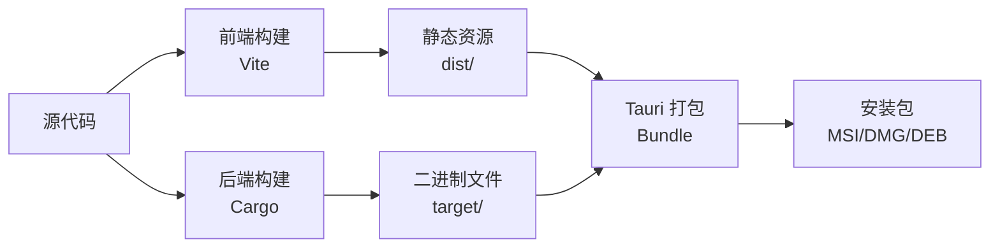

# 构建和部署指南

本文档详细说明了 Pot 项目的构建流程、部署策略和发布管理。

## 🏗️ 构建系统概览

### 构建架构



### 构建工具链

| 组件     | 工具      | 版本要求 | 用途              |
| -------- | --------- | -------- | ----------------- |
| 前端构建 | Vite      | ^5.4.10  | 打包 React 应用   |
| 后端构建 | Cargo     | 1.70+    | 编译 Rust 代码    |
| 应用打包 | Tauri CLI | ^1.6.3   | 生成安装包        |
| 依赖管理 | pnpm      | ^8.0.0   | 管理 Node.js 依赖 |

## 🔧 本地构建

### 开发构建

#### 前端开发构建

```bash
# 启动开发服务器
pnpm dev

# 构建开发版本
pnpm build:dev
```

**配置**: `vite.config.js`

```javascript
export default defineConfig({
    mode: 'development',
    build: {
        sourcemap: true,
        minify: false,
        rollupOptions: {
            output: {
                manualChunks: {
                    vendor: ['react', 'react-dom'],
                    ui: ['@nextui-org/react'],
                },
            },
        },
    },
    define: {
        __DEV__: true,
    },
});
```

#### 后端开发构建

```bash
# 构建 debug 版本
cd src-tauri
cargo build

# 运行开发环境
cargo run
```

#### 完整开发环境

```bash
# 启动完整开发环境
pnpm tauri dev

# 这个命令会：
# 1. 启动 Vite 开发服务器
# 2. 编译 Rust 代码
# 3. 启动 Tauri 应用
# 4. 启用热重载
```

### 生产构建

#### 前端生产构建

```bash
# 构建生产版本
pnpm build

# 预览构建结果
pnpm preview
```

**生产配置**: `vite.config.js`

```javascript
export default defineConfig({
    mode: 'production',
    build: {
        outDir: 'dist',
        assetsDir: 'assets',
        sourcemap: false,
        minify: 'terser',
        rollupOptions: {
            output: {
                manualChunks: {
                    vendor: ['react', 'react-dom'],
                    ui: ['@nextui-org/react', 'framer-motion'],
                    icons: ['react-icons'],
                    utils: ['crypto-js', 'md5', 'uuid'],
                },
            },
        },
        terserOptions: {
            compress: {
                drop_console: true,
                drop_debugger: true,
            },
        },
    },
    define: {
        __DEV__: false,
    },
});
```

#### 后端生产构建

```bash
# 构建 release 版本
cd src-tauri
cargo build --release

# 优化构建配置
# Cargo.toml 中的 [profile.release] 配置
```

**生产配置**: `Cargo.toml`

```toml
[profile.release]
opt-level = 3          # 最高优化级别
lto = true             # 链接时优化
codegen-units = 1      # 减少代码生成单元
panic = "abort"        # 减少二进制大小
strip = true           # 移除调试符号
```

#### 完整应用构建

```bash
# 构建完整应用
pnpm tauri build

# 构建特定平台
pnpm tauri build --target x86_64-pc-windows-msvc  # Windows
pnpm tauri build --target x86_64-apple-darwin     # macOS Intel
pnpm tauri build --target aarch64-apple-darwin    # macOS Apple Silicon
pnpm tauri build --target x86_64-unknown-linux-gnu # Linux
```

## 📦 打包配置

### Tauri 配置

**主配置**: `src-tauri/tauri.conf.json`

```json
{
    "build": {
        "beforeBuildCommand": "pnpm build",
        "beforeDevCommand": "pnpm dev",
        "devPath": "http://localhost:1420",
        "distDir": "../dist",
        "withGlobalTauri": false
    },
    "package": {
        "productName": "Pot",
        "version": "3.0.7"
    },
    "tauri": {
        "allowlist": {
            "all": false,
            "shell": {
                "all": false,
                "open": true
            },
            "dialog": {
                "all": false,
                "open": true,
                "save": true
            },
            "fs": {
                "all": true,
                "scope": ["$APPDATA", "$APPDATA/**"]
            }
        },
        "bundle": {
            "active": true,
            "targets": "all",
            "identifier": "com.pot-app.pot",
            "icon": [
                "icons/32x32.png",
                "icons/128x128.png",
                "icons/128x128@2x.png",
                "icons/icon.icns",
                "icons/icon.ico"
            ]
        },
        "security": {
            "csp": null
        },
        "updater": {
            "active": true,
            "endpoints": ["https://github.com/pot-app/pot-desktop/releases/latest/download/latest.json"],
            "dialog": true,
            "pubkey": "dW50cnVzdGVkIGNvbW1lbnQ6IG1pbmlzaWduIHB1YmxpYyBrZXk6IDUxQkY4NEY5RDM5NzNGQ0UKRZ9Xf8F5yQ8kAE1+7Ds9Pk4G5yV7Vs9Uk4V8Lf1Kq8G5qV8G5yV7Vs9Uk4V8="
        },
        "windows": [
            {
                "fullscreen": false,
                "height": 600,
                "resizable": true,
                "title": "Pot",
                "width": 800,
                "center": true,
                "decorations": true
            }
        ],
        "systemTray": {
            "iconPath": "icons/tray.ico",
            "iconAsTemplate": true
        }
    }
}
```

### 平台特定配置

#### Windows 配置

**`src-tauri/tauri.windows.conf.json`**:

```json
{
    "tauri": {
        "bundle": {
            "windows": {
                "certificateThumbprint": null,
                "digestAlgorithm": "sha256",
                "timestampUrl": "",
                "wix": {
                    "language": ["en-US", "zh-CN"],
                    "template": "templates/main.wxs"
                }
            }
        }
    }
}
```

#### macOS 配置

**`src-tauri/tauri.macos.conf.json`**:

```json
{
    "tauri": {
        "bundle": {
            "macOS": {
                "frameworks": [],
                "minimumSystemVersion": "10.15",
                "exceptionDomain": "",
                "signingIdentity": null,
                "entitlements": "entitlements.plist"
            }
        }
    }
}
```

#### Linux 配置

**`src-tauri/tauri.linux.conf.json`**:

```json
{
    "tauri": {
        "bundle": {
            "linux": {
                "deb": {
                    "depends": ["libwebkit2gtk-4.0-37", "libgtk-3-0"],
                    "files": {
                        "/usr/share/applications/pot.desktop": "templates/pot.desktop"
                    }
                },
                "appimage": {
                    "bundleMediaFramework": false,
                    "files": {}
                }
            }
        }
    }
}
```

## 🚀 部署策略

### 部署环境

#### 1. 开发环境 (Development)

**用途**: 日常开发和功能测试

**特点**:

-   自动部署 `develop` 分支
-   启用调试功能
-   快速迭代

**配置**:

```bash
# 环境变量
NODE_ENV=development
RUST_LOG=debug
TAURI_DEBUG=true
```

#### 2. 测试环境 (Staging)

**用途**: 发布前验证和集成测试

**特点**:

-   部署 `release/*` 分支
-   模拟生产环境
-   完整功能测试

**配置**:

```bash
# 环境变量
NODE_ENV=production
RUST_LOG=info
ENABLE_ANALYTICS=false
```

#### 3. 生产环境 (Production)

**用途**: 正式发布给用户

**特点**:

-   部署 `main` 分支标签
-   最高稳定性要求
-   完整监控

**配置**:

```bash
# 环境变量
NODE_ENV=production
RUST_LOG=warn
ENABLE_ANALYTICS=true
ENABLE_CRASH_REPORTING=true
```

### 发布渠道

#### 1. GitHub Releases

**主要发布渠道**，包含所有平台的安装包：

```bash
# 发布脚本
gh release create v3.1.0 \
  --title "Release v3.1.0" \
  --notes-file RELEASE_NOTES.md \
  src-tauri/target/release/bundle/msi/*.msi \
  src-tauri/target/release/bundle/dmg/*.dmg \
  src-tauri/target/release/bundle/deb/*.deb \
  src-tauri/target/release/bundle/appimage/*.AppImage
```

#### 2. 包管理器

**计划支持的包管理器**:

-   **Windows**: Chocolatey, Scoop, winget
-   **macOS**: Homebrew
-   **Linux**: AUR, Flatpak, Snap

#### 3. 应用商店

**计划上架的应用商店**:

-   Microsoft Store (Windows)
-   Mac App Store (macOS)
-   Flathub (Linux)

## 🔐 安全和签名

### 代码签名

#### Windows 签名

```powershell
# 使用证书签名
signtool sign /f certificate.pfx /p password /t http://timestamp.digicert.com pot.msi

# 验证签名
signtool verify /pa pot.msi
```

#### macOS 签名和公证

```bash
# 代码签名
codesign --force --deep --sign "Developer ID Application: Your Name" Pot.app

# 创建 DMG
hdiutil create -srcfolder Pot.app -format UDZO Pot.dmg

# 签名 DMG
codesign --sign "Developer ID Application: Your Name" Pot.dmg

# 公证
xcrun notarytool submit Pot.dmg --keychain-profile "notarytool-profile" --wait

# 装订公证票据
xcrun stapler staple Pot.dmg
```

#### Linux 签名

```bash
# 使用 GPG 签名
gpg --armor --detach-sign pot.deb

# 验证签名
gpg --verify pot.deb.asc pot.deb
```

### 安全检查

#### 依赖安全扫描

```bash
# Node.js 依赖扫描
pnpm audit
pnpm audit --fix

# Rust 依赖扫描
cargo install cargo-audit
cargo audit

# 第三方安全扫描
npm install -g snyk
snyk test
```

#### 代码安全扫描

```bash
# 使用 CodeQL 扫描
# GitHub Actions 中自动运行

# 使用 Semgrep 扫描
pip install semgrep
semgrep --config=auto src/
```

## 🤖 自动化构建

### GitHub Actions 工作流

#### 构建工作流

```yaml
# .github/workflows/build.yml
name: Build Application

on:
    push:
        branches: [main, develop]
        tags: ['v*']
    pull_request:
        branches: [main, develop]

jobs:
    build:
        strategy:
            fail-fast: false
            matrix:
                platform: [macos-latest, ubuntu-20.04, windows-latest]

        runs-on: ${{ matrix.platform }}

        steps:
            - name: Checkout repository
              uses: actions/checkout@v3

            - name: Setup Node.js
              uses: actions/setup-node@v3
              with:
                  node-version: 18
                  cache: 'pnpm'

            - name: Setup Rust
              uses: dtolnay/rust-toolchain@stable
              with:
                  targets: ${{ matrix.platform == 'macos-latest' && 'aarch64-apple-darwin,x86_64-apple-darwin' || '' }}

            - name: Setup pnpm
              uses: pnpm/action-setup@v2
              with:
                  version: latest

            - name: Install dependencies
              run: pnpm install

            - name: Build frontend
              run: pnpm build

            - name: Build application
              run: pnpm tauri build
              env:
                  GITHUB_TOKEN: ${{ secrets.GITHUB_TOKEN }}
                  TAURI_PRIVATE_KEY: ${{ secrets.TAURI_PRIVATE_KEY }}
                  TAURI_KEY_PASSWORD: ${{ secrets.TAURI_KEY_PASSWORD }}

            - name: Upload artifacts
              uses: actions/upload-artifact@v3
              with:
                  name: ${{ matrix.platform }}-build
                  path: |
                      src-tauri/target/release/bundle/*/*
```

#### 发布工作流

```yaml
# .github/workflows/release.yml
name: Release

on:
    push:
        tags: ['v*']

jobs:
    create-release:
        runs-on: ubuntu-latest
        outputs:
            release_id: ${{ steps.create-release.outputs.result }}

        steps:
            - name: Checkout repository
              uses: actions/checkout@v3

            - name: Create release
              id: create-release
              uses: actions/github-script@v6
              with:
                  script: |
                      const { data } = await github.rest.repos.createRelease({
                        owner: context.repo.owner,
                        repo: context.repo.repo,
                        tag_name: `${context.ref.replace('refs/tags/', '')}`,
                        name: `Release ${context.ref.replace('refs/tags/', '')}`,
                        body: 'Release notes will be updated automatically.',
                        draft: true,
                        prerelease: false
                      })
                      return data.id

    build-and-upload:
        needs: create-release
        strategy:
            matrix:
                platform: [macos-latest, ubuntu-20.04, windows-latest]

        runs-on: ${{ matrix.platform }}

        steps:
            # ... 构建步骤 (同上) ...

            - name: Upload release assets
              uses: actions/github-script@v6
              with:
                  script: |
                      const fs = require('fs');
                      const path = require('path');

                      // 上传构建产物到 Release
                      // 具体实现根据平台和文件类型
```

### 本地自动化脚本

#### 构建脚本

```bash
#!/bin/bash
# scripts/build.sh

set -e

echo "🏗️ Starting build process..."

# 检查环境
echo "📋 Checking environment..."
node --version
cargo --version
pnpm --version

# 清理之前的构建
echo "🧹 Cleaning previous builds..."
rm -rf dist/
rm -rf src-tauri/target/release/bundle/

# 安装依赖
echo "📦 Installing dependencies..."
pnpm install

# 运行测试
echo "🧪 Running tests..."
pnpm test

# 构建前端
echo "⚛️ Building frontend..."
pnpm build

# 构建应用
echo "🦀 Building application..."
pnpm tauri build

echo "✅ Build completed successfully!"

# 显示构建产物
echo "📁 Build artifacts:"
find src-tauri/target/release/bundle/ -name "*.msi" -o -name "*.dmg" -o -name "*.deb" -o -name "*.AppImage"
```

#### 发布脚本

```bash
#!/bin/bash
# scripts/release.sh

set -e

VERSION=$1
if [ -z "$VERSION" ]; then
    echo "Usage: $0 <version>"
    echo "Example: $0 3.1.0"
    exit 1
fi

echo "🚀 Preparing release v$VERSION..."

# 检查是否在正确的分支
CURRENT_BRANCH=$(git branch --show-current)
if [ "$CURRENT_BRANCH" != "main" ]; then
    echo "❌ Must be on main branch for release"
    exit 1
fi

# 检查工作目录是否干净
if [ -n "$(git status --porcelain)" ]; then
    echo "❌ Working directory is not clean"
    exit 1
fi

# 更新版本号
echo "📝 Updating version numbers..."
npm version "$VERSION" --no-git-tag-version

# 更新 Cargo.toml
cd src-tauri
cargo set-version "$VERSION"
cd ..

# 生成变更日志
echo "📋 Generating changelog..."
# 这里可以集成 conventional-changelog 等工具

# 构建发布版本
echo "🏗️ Building release..."
pnpm tauri build

# 创建 Git 标签
echo "🏷️ Creating git tag..."
git add .
git commit -m "chore: release v$VERSION"
git tag "v$VERSION"

# 推送到远程
echo "📤 Pushing to remote..."
git push origin main
git push origin "v$VERSION"

echo "✅ Release v$VERSION completed!"
echo "👉 Next steps:"
echo "   1. GitHub Actions will automatically create release"
echo "   2. Upload release notes"
echo "   3. Announce release"
```

## 📊 构建优化

### 构建性能优化

#### 前端优化

```javascript
// vite.config.js
export default defineConfig({
    build: {
        rollupOptions: {
            output: {
                manualChunks: (id) => {
                    // 分离第三方库
                    if (id.includes('node_modules')) {
                        if (id.includes('react')) {
                            return 'react-vendor';
                        }
                        if (id.includes('@nextui-org')) {
                            return 'ui-vendor';
                        }
                        return 'vendor';
                    }
                },
            },
        },
        // 启用构建缓存
        cache: true,
        // 优化 chunk 大小
        chunkSizeWarningLimit: 1000,
    },
    // 优化依赖预构建
    optimizeDeps: {
        include: ['react', 'react-dom', '@nextui-org/react'],
        exclude: ['@tauri-apps/api'],
    },
});
```

#### 后端优化

```toml
# Cargo.toml
[profile.release]
opt-level = 3
lto = "fat"           # 全局链接时优化
codegen-units = 1
panic = "abort"
strip = "symbols"     # 移除调试符号

# 启用增量编译缓存
[profile.dev]
incremental = true

# 依赖优化
[profile.dev.package."*"]
opt-level = 2         # 优化依赖包
```

### 构建缓存

#### CI/CD 缓存

```yaml
# GitHub Actions 缓存配置
- name: Cache Node.js dependencies
  uses: actions/cache@v3
  with:
      path: ~/.pnpm-store
      key: ${{ runner.os }}-pnpm-${{ hashFiles('**/pnpm-lock.yaml') }}

- name: Cache Rust dependencies
  uses: actions/cache@v3
  with:
      path: |
          ~/.cargo/registry
          ~/.cargo/git
          src-tauri/target
      key: ${{ runner.os }}-cargo-${{ hashFiles('**/Cargo.lock') }}

- name: Cache Tauri build
  uses: actions/cache@v3
  with:
      path: src-tauri/target/release/build
      key: ${{ runner.os }}-tauri-${{ hashFiles('src-tauri/src/**/*.rs') }}
```

#### 本地缓存

```bash
# 启用 Rust 增量编译
export CARGO_INCREMENTAL=1

# 启用 sccache (Rust 编译缓存)
cargo install sccache
export RUSTC_WRAPPER=sccache

# 启用 pnpm 存储缓存
pnpm config set store-dir ~/.pnpm-store
```

## 📈 监控和分析

### 构建监控

#### 构建时间分析

```bash
# 分析构建时间
time pnpm tauri build

# Rust 编译时间分析
cargo install cargo-timings
cargo build --release --timings
```

#### 包大小分析

```bash
# 前端包大小分析
pnpm build --analyze

# 查看 bundle 分析
npx vite-bundle-analyzer dist

# Rust 二进制大小分析
cargo install cargo-bloat
cargo bloat --release
```

### 部署监控

#### 发布成功率

-   **构建成功率**: > 95%
-   **测试通过率**: > 98%
-   **部署成功率**: > 99%

#### 性能指标

-   **构建时间**: < 10 分钟
-   **测试时间**: < 5 分钟
-   **部署时间**: < 2 分钟

## 🔄 回滚策略

### 快速回滚

#### 1. 版本回滚

```bash
# 回滚到上一个版本
git checkout main
git reset --hard v3.0.6
git push --force-with-lease origin main

# 创建回滚标签
git tag v3.0.7-rollback
git push origin v3.0.7-rollback
```

#### 2. 功能开关

```javascript
// 使用功能开关控制新功能
const FEATURE_FLAGS = {
    NEW_TRANSLATION_SERVICE: process.env.ENABLE_NEW_SERVICE === 'true',
    EXPERIMENTAL_OCR: process.env.ENABLE_EXPERIMENTAL_OCR === 'true',
};

// 在代码中使用
if (FEATURE_FLAGS.NEW_TRANSLATION_SERVICE) {
    return newTranslationService.translate(text);
} else {
    return legacyTranslationService.translate(text);
}
```

#### 3. 灰度发布

```javascript
// 基于用户 ID 的灰度发布
function shouldEnableFeature(userId, featureName) {
    const hash = crypto
        .createHash('md5')
        .update(userId + featureName)
        .digest('hex');
    const percentage = parseInt(hash.substring(0, 2), 16) / 255;

    const rolloutPercentage = {
        'new-translation-ui': 0.1, // 10% 用户
        'improved-ocr': 0.5, // 50% 用户
    };

    return percentage < (rolloutPercentage[featureName] || 0);
}
```

## 📋 部署检查清单

### 发布前检查

#### 代码质量

-   [ ] 所有测试通过
-   [ ] 代码覆盖率达标
-   [ ] 代码审查完成
-   [ ] 安全扫描通过
-   [ ] 性能测试通过

#### 功能验证

-   [ ] 核心功能正常
-   [ ] 新功能按预期工作
-   [ ] 回归测试通过
-   [ ] 兼容性测试通过
-   [ ] 用户体验验证

#### 文档和流程

-   [ ] 发布说明准备完成
-   [ ] 用户文档已更新
-   [ ] API 文档已更新
-   [ ] 变更日志已更新
-   [ ] 回滚计划已准备

### 发布后检查

#### 技术指标

-   [ ] 应用启动正常
-   [ ] 核心功能可用
-   [ ] 性能指标正常
-   [ ] 错误率在预期范围
-   [ ] 资源使用正常

#### 用户反馈

-   [ ] 用户反馈收集
-   [ ] 社区讨论监控
-   [ ] 问题报告处理
-   [ ] 使用数据分析

## 🔧 故障排除

### 常见构建问题

#### 依赖问题

```bash
# 清理并重新安装依赖
rm -rf node_modules pnpm-lock.yaml
pnpm install

# 清理 Rust 构建缓存
cd src-tauri
cargo clean
cargo build
```

#### 平台特定问题

**Windows**:

```bash
# 确保有正确的工具链
rustup target add x86_64-pc-windows-msvc

# 检查 Visual Studio 组件
where cl.exe
```

**macOS**:

```bash
# 确保有 Xcode Command Line Tools
xcode-select --install

# 添加目标架构
rustup target add aarch64-apple-darwin
rustup target add x86_64-apple-darwin
```

**Linux**:

```bash
# 确保有必要的系统库
sudo apt-get update
sudo apt-get install -y libwebkit2gtk-4.0-dev build-essential curl wget libssl-dev libgtk-3-dev libayatana-appindicator3-dev librsvg2-dev
```

### 部署问题诊断

#### 日志收集

```bash
# 构建日志
pnpm tauri build > build.log 2>&1

# 运行时日志
RUST_LOG=debug ./pot > runtime.log 2>&1

# 系统日志
# Windows: Event Viewer
# macOS: Console.app
# Linux: journalctl -f
```

#### 性能分析

```bash
# 分析构建性能
cargo build --release --timings

# 分析运行时性能
cargo install cargo-profiler
cargo profiler callgrind --bin pot
```

## 📚 相关文档

-   [开发环境搭建](development-setup.md) - 环境配置
-   [代码规范](coding-standards.md) - 编码标准
-   [测试指南](testing.md) - 测试策略
-   [开发常见问题](troubleshooting.md) - 问题解决

---

_构建和部署流程会随着项目发展持续优化，欢迎提出改进建议。_
