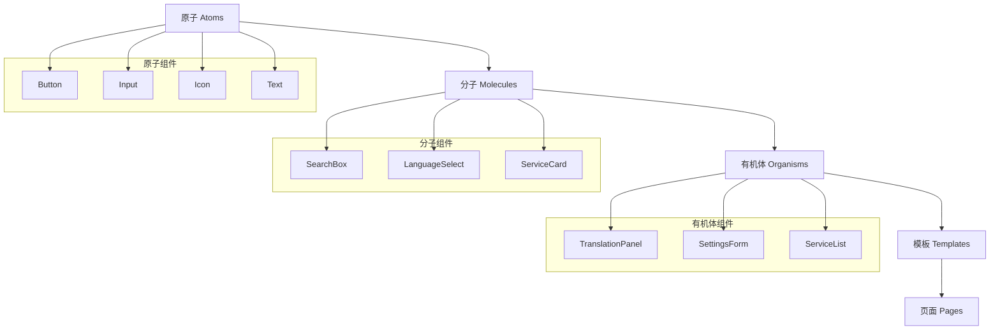

# 组件开发指南

本文档详细说明了 Pot 项目的组件架构、开发规范和最佳实践。

## 🎨 组件架构概览

### 原子设计系统

Pot 采用原子设计系统 (Atomic Design) 组织组件结构：



### 组件分层结构

```
src/components/
├── atoms/                  # 原子组件
│   ├── Button/
│   ├── Input/
│   ├── Icon/
│   ├── Text/
│   └── index.js
├── molecules/              # 分子组件
│   ├── SearchBox/
│   ├── LanguageSelect/
│   ├── ServiceCard/
│   └── index.js
├── organisms/              # 有机体组件
│   ├── TranslationPanel/
│   ├── SettingsForm/
│   ├── ServiceList/
│   └── index.js
├── templates/              # 模板组件
│   ├── MainLayout/
│   ├── ConfigLayout/
│   └── index.js
└── common/                 # 通用组件
    ├── WindowControl/
    ├── Loading/
    └── ErrorBoundary/
```

## ⚛️ 原子组件 (Atoms)

### Button 组件

**文件位置**: `src/components/atoms/Button/index.jsx`

```javascript
import React from 'react';
import { Button as NextUIButton } from '@nextui-org/react';
import { cn } from '../../../utils/cn';

const Button = ({
    children,
    variant = 'solid',
    size = 'md',
    color = 'primary',
    isLoading = false,
    isDisabled = false,
    startContent,
    endContent,
    className,
    onClick,
    ...props
}) => {
    return (
        <NextUIButton
            variant={variant}
            size={size}
            color={color}
            isLoading={isLoading}
            isDisabled={isDisabled}
            startContent={startContent}
            endContent={endContent}
            className={cn('font-medium', className)}
            onPress={onClick}
            {...props}
        >
            {children}
        </NextUIButton>
    );
};

export default Button;
```

**属性说明**:

| 属性           | 类型                                                                           | 默认值      | 描述               |
| -------------- | ------------------------------------------------------------------------------ | ----------- | ------------------ |
| `variant`      | `'solid' \| 'bordered' \| 'light' \| 'flat' \| 'faded' \| 'shadow' \| 'ghost'` | `'solid'`   | 按钮样式变体       |
| `size`         | `'sm' \| 'md' \| 'lg'`                                                         | `'md'`      | 按钮尺寸           |
| `color`        | `'primary' \| 'secondary' \| 'success' \| 'warning' \| 'danger'`               | `'primary'` | 按钮颜色           |
| `isLoading`    | `boolean`                                                                      | `false`     | 是否显示加载状态   |
| `isDisabled`   | `boolean`                                                                      | `false`     | 是否禁用           |
| `startContent` | `ReactNode`                                                                    | -           | 前置内容（图标等） |
| `endContent`   | `ReactNode`                                                                    | -           | 后置内容（图标等） |

**测试文件**: `src/components/atoms/Button/__tests__/Button.test.jsx`

```javascript
import { render, screen, fireEvent } from '@testing-library/react';
import Button from '../index';

describe('Button Component', () => {
    it('should render with default props', () => {
        render(<Button>Click me</Button>);

        const button = screen.getByRole('button');
        expect(button).toBeInTheDocument();
        expect(button).toHaveTextContent('Click me');
    });

    it('should handle click events', () => {
        const handleClick = jest.fn();
        render(<Button onClick={handleClick}>Click me</Button>);

        fireEvent.click(screen.getByRole('button'));
        expect(handleClick).toHaveBeenCalledTimes(1);
    });

    it('should show loading state', () => {
        render(<Button isLoading>Loading</Button>);

        expect(screen.getByRole('button')).toBeDisabled();
    });

    it('should render with start and end content', () => {
        render(
            <Button
                startContent={<span data-testid='start'>🔤</span>}
                endContent={<span data-testid='end'>→</span>}
            >
                Translate
            </Button>
        );

        expect(screen.getByTestId('start')).toBeInTheDocument();
        expect(screen.getByTestId('end')).toBeInTheDocument();
    });
});
```

### Input 组件

**文件位置**: `src/components/atoms/Input/index.jsx`

```javascript
import React, { forwardRef } from 'react';
import { Input as NextUIInput } from '@nextui-org/react';
import { cn } from '../../../utils/cn';

const Input = forwardRef(
    (
        {
            label,
            placeholder,
            value,
            defaultValue,
            onChange,
            onValueChange,
            type = 'text',
            size = 'md',
            variant = 'bordered',
            color = 'primary',
            isRequired = false,
            isDisabled = false,
            isReadOnly = false,
            isInvalid = false,
            errorMessage,
            description,
            startContent,
            endContent,
            className,
            ...props
        },
        ref
    ) => {
        const handleChange = (value) => {
            if (onValueChange) {
                onValueChange(value);
            }
            if (onChange) {
                onChange({ target: { value } });
            }
        };

        return (
            <NextUIInput
                ref={ref}
                label={label}
                placeholder={placeholder}
                value={value}
                defaultValue={defaultValue}
                onValueChange={handleChange}
                type={type}
                size={size}
                variant={variant}
                color={color}
                isRequired={isRequired}
                isDisabled={isDisabled}
                isReadOnly={isReadOnly}
                isInvalid={isInvalid}
                errorMessage={errorMessage}
                description={description}
                startContent={startContent}
                endContent={endContent}
                className={cn('w-full', className)}
                {...props}
            />
        );
    }
);

Input.displayName = 'Input';

export default Input;
```

## 🧬 分子组件 (Molecules)

### LanguageSelect 组件

**文件位置**: `src/components/molecules/LanguageSelect/index.jsx`

```javascript
import React from 'react';
import { Select, SelectItem } from '@nextui-org/react';
import { useTranslation } from 'react-i18next';
import { LanguageFlag } from '../../../utils/language';

const LanguageSelect = ({
    value,
    onChange,
    languages,
    placeholder = 'Select language',
    size = 'md',
    variant = 'bordered',
    isDisabled = false,
    className,
    ...props
}) => {
    const { t } = useTranslation();

    const handleSelectionChange = (keys) => {
        const selectedValue = Array.from(keys)[0];
        if (onChange) {
            onChange(selectedValue);
        }
    };

    return (
        <Select
            selectedKeys={value ? [value] : []}
            onSelectionChange={handleSelectionChange}
            placeholder={placeholder}
            size={size}
            variant={variant}
            isDisabled={isDisabled}
            className={className}
            renderValue={(items) => {
                return items.map((item) => (
                    <div
                        key={item.key}
                        className='flex items-center gap-2'
                    >
                        <LanguageFlag language={item.key} />
                        <span>{item.textValue}</span>
                    </div>
                ));
            }}
            {...props}
        >
            {languages.map((language) => (
                <SelectItem
                    key={language.code}
                    value={language.code}
                    textValue={language.name}
                    startContent={<LanguageFlag language={language.code} />}
                >
                    {language.name}
                </SelectItem>
            ))}
        </Select>
    );
};

export default LanguageSelect;
```

### ServiceCard 组件

**文件位置**: `src/components/molecules/ServiceCard/index.jsx`

```javascript
import React from 'react';
import { Card, CardBody, Switch, Button, Chip } from '@nextui-org/react';
import { useTranslation } from 'react-i18next';
import { MdSettings, MdInfo } from 'react-icons/md';

const ServiceCard = ({
    service,
    isEnabled,
    onToggle,
    onConfigure,
    onTest,
    isConfigured = false,
    isOnline = true,
    className,
}) => {
    const { t } = useTranslation();

    const getStatusColor = () => {
        if (!isEnabled) return 'default';
        if (!isConfigured) return 'warning';
        if (!isOnline) return 'danger';
        return 'success';
    };

    const getStatusText = () => {
        if (!isEnabled) return t('service.status.disabled');
        if (!isConfigured) return t('service.status.not_configured');
        if (!isOnline) return t('service.status.offline');
        return t('service.status.online');
    };

    return (
        <Card className={className}>
            <CardBody className='p-4'>
                <div className='flex items-center justify-between mb-3'>
                    <div className='flex items-center gap-3'>
                        
                        <div>
                            <h3 className='text-lg font-semibold'>{service.name}</h3>
                            <p className='text-sm text-gray-600'>{service.description}</p>
                        </div>
                    </div>
                    <Switch
                        isSelected={isEnabled}
                        onValueChange={onToggle}
                        size='sm'
                    />
                </div>

                <div className='flex items-center justify-between'>
                    <Chip
                        color={getStatusColor()}
                        variant='flat'
                        size='sm'
                    >
                        {getStatusText()}
                    </Chip>

                    <div className='flex gap-2'>
                        {isEnabled && (
                            <>
                                <Button
                                    size='sm'
                                    variant='flat'
                                    startContent={<MdSettings />}
                                    onPress={onConfigure}
                                >
                                    {t('service.configure')}
                                </Button>
                                {isConfigured && (
                                    <Button
                                        size='sm'
                                        variant='flat'
                                        startContent={<MdInfo />}
                                        onPress={onTest}
                                    >
                                        {t('service.test')}
                                    </Button>
                                )}
                            </>
                        )}
                    </div>
                </div>
            </CardBody>
        </Card>
    );
};

export default ServiceCard;
```

## 🧬 有机体组件 (Organisms)

### TranslationPanel 组件

**文件位置**: `src/components/organisms/TranslationPanel/index.jsx`

```javascript
import React, { useState, useCallback } from 'react';
import { Card, CardBody, Textarea, Divider } from '@nextui-org/react';
import { useTranslation } from 'react-i18next';
import { MdSwapVert, MdContentCopy, MdVolumeUp } from 'react-icons/md';

import Button from '../../atoms/Button';
import LanguageSelect from '../../molecules/LanguageSelect';
import { useTranslationService } from '../../../hooks/useTranslationService';
import { useSupportedLanguages } from '../../../hooks/useSupportedLanguages';
import { useClipboard } from '../../../hooks/useClipboard';
import { useTTS } from '../../../hooks/useTTS';

const TranslationPanel = ({ initialText = '', onTranslationComplete, className }) => {
    const { t } = useTranslation();
    const [sourceText, setSourceText] = useState(initialText);
    const [targetText, setTargetText] = useState('');
    const [sourceLanguage, setSourceLanguage] = useState('auto');
    const [targetLanguage, setTargetLanguage] = useState('zh');

    const { translate, isLoading, error } = useTranslationService();
    const { languages } = useSupportedLanguages();
    const { copyToClipboard } = useClipboard();
    const { speak, isPlaying } = useTTS();

    const handleTranslate = useCallback(async () => {
        if (!sourceText.trim()) return;

        try {
            const result = await translate({
                text: sourceText,
                from: sourceLanguage,
                to: targetLanguage,
            });

            setTargetText(result.text);

            if (onTranslationComplete) {
                onTranslationComplete(result);
            }
        } catch (err) {
            console.error('Translation failed:', err);
        }
    }, [sourceText, sourceLanguage, targetLanguage, translate, onTranslationComplete]);

    const handleSwapLanguages = useCallback(() => {
        if (sourceLanguage === 'auto') return;

        setSourceLanguage(targetLanguage);
        setTargetLanguage(sourceLanguage);
        setSourceText(targetText);
        setTargetText(sourceText);
    }, [sourceLanguage, targetLanguage, sourceText, targetText]);

    const handleCopyResult = useCallback(() => {
        if (targetText) {
            copyToClipboard(targetText);
        }
    }, [targetText, copyToClipboard]);

    const handleSpeak = useCallback(
        (text, language) => {
            speak(text, language);
        },
        [speak]
    );

    return (
        <Card className={className}>
            <CardBody className='p-6'>
                {/* 语言选择器 */}
                <div className='flex items-center gap-4 mb-4'>
                    <LanguageSelect
                        value={sourceLanguage}
                        onChange={setSourceLanguage}
                        languages={languages}
                        placeholder={t('translation.source_language')}
                        className='flex-1'
                    />

                    <Button
                        isIconOnly
                        variant='flat'
                        size='sm'
                        isDisabled={sourceLanguage === 'auto'}
                        onPress={handleSwapLanguages}
                    >
                        <MdSwapVert className='text-lg' />
                    </Button>

                    <LanguageSelect
                        value={targetLanguage}
                        onChange={setTargetLanguage}
                        languages={languages}
                        placeholder={t('translation.target_language')}
                        className='flex-1'
                    />
                </div>

                {/* 输入区域 */}
                <div className='grid grid-cols-1 lg:grid-cols-2 gap-4'>
                    <div className='space-y-2'>
                        <div className='flex items-center justify-between'>
                            <span className='text-sm font-medium'>{t('translation.source_text')}</span>
                            <Button
                                size='sm'
                                variant='flat'
                                startContent={<MdVolumeUp />}
                                isDisabled={!sourceText || isPlaying}
                                onPress={() => handleSpeak(sourceText, sourceLanguage)}
                            >
                                {t('translation.speak')}
                            </Button>
                        </div>
                        <Textarea
                            value={sourceText}
                            onValueChange={setSourceText}
                            placeholder={t('translation.enter_text')}
                            minRows={6}
                            maxRows={12}
                        />
                    </div>

                    <div className='space-y-2'>
                        <div className='flex items-center justify-between'>
                            <span className='text-sm font-medium'>{t('translation.result')}</span>
                            <div className='flex gap-2'>
                                <Button
                                    size='sm'
                                    variant='flat'
                                    startContent={<MdVolumeUp />}
                                    isDisabled={!targetText || isPlaying}
                                    onPress={() => handleSpeak(targetText, targetLanguage)}
                                >
                                    {t('translation.speak')}
                                </Button>
                                <Button
                                    size='sm'
                                    variant='flat'
                                    startContent={<MdContentCopy />}
                                    isDisabled={!targetText}
                                    onPress={handleCopyResult}
                                >
                                    {t('translation.copy')}
                                </Button>
                            </div>
                        </div>
                        <Textarea
                            value={targetText}
                            placeholder={t('translation.result_placeholder')}
                            isReadOnly
                            minRows={6}
                            maxRows={12}
                            color={error ? 'danger' : 'default'}
                        />
                        {error && <p className='text-sm text-danger'>{error}</p>}
                    </div>
                </div>

                <Divider className='my-4' />

                {/* 操作按钮 */}
                <div className='flex justify-center'>
                    <Button
                        size='lg'
                        color='primary'
                        isLoading={isLoading}
                        isDisabled={!sourceText.trim()}
                        onPress={handleTranslate}
                    >
                        {isLoading ? t('translation.translating') : t('translation.translate')}
                    </Button>
                </div>
            </CardBody>
        </Card>
    );
};

export default TranslationPanel;
```

## 🎣 Hooks 开发

### 自定义 Hook 规范

#### useTranslationService Hook

**文件位置**: `src/hooks/useTranslationService.jsx`

```javascript
import { useState, useCallback } from 'react';
import { invoke } from '@tauri-apps/api/tauri';
import { useAtom } from 'jotai';
import { translationHistoryAtom } from '../store/atoms';

export const useTranslationService = () => {
    const [isLoading, setIsLoading] = useState(false);
    const [error, setError] = useState(null);
    const [history, setHistory] = useAtom(translationHistoryAtom);

    const translate = useCallback(
        async ({ text, from, to, service }) => {
            setIsLoading(true);
            setError(null);

            try {
                const result = await invoke('translate_text', {
                    text: text.trim(),
                    from,
                    to,
                    service,
                });

                // 添加到历史记录
                const historyItem = {
                    id: crypto.randomUUID(),
                    sourceText: text,
                    targetText: result.text,
                    sourceLanguage: from,
                    targetLanguage: to,
                    service: result.service,
                    timestamp: new Date().toISOString(),
                };

                setHistory((prev) => [historyItem, ...prev.slice(0, 999)]);

                return result;
            } catch (err) {
                const errorMessage = err.message || t('translation.error.unknown');
                setError(errorMessage);
                throw new Error(errorMessage);
            } finally {
                setIsLoading(false);
            }
        },
        [setHistory]
    );

    const clearError = useCallback(() => {
        setError(null);
    }, []);

    return {
        translate,
        isLoading,
        error,
        clearError,
        history,
    };
};
```

#### useConfig Hook

**文件位置**: `src/hooks/useConfig.jsx`

```javascript
import { useState, useEffect, useCallback } from 'react';
import { invoke } from '@tauri-apps/api/tauri';
import { listen } from '@tauri-apps/api/event';

export const useConfig = (key, defaultValue) => {
    const [value, setValue] = useState(defaultValue);
    const [isLoading, setIsLoading] = useState(true);

    // 加载配置
    useEffect(() => {
        const loadConfig = async () => {
            try {
                const config = await invoke('get_config', { key });
                setValue(config !== null ? config : defaultValue);
            } catch (error) {
                console.warn(`Failed to load config for ${key}:`, error);
                setValue(defaultValue);
            } finally {
                setIsLoading(false);
            }
        };

        loadConfig();
    }, [key, defaultValue]);

    // 监听配置变更
    useEffect(() => {
        const unlisten = listen('config-changed', (event) => {
            if (event.payload.key === key) {
                setValue(event.payload.value);
            }
        });

        return () => {
            unlisten.then((fn) => fn());
        };
    }, [key]);

    // 更新配置
    const updateValue = useCallback(
        async (newValue) => {
            try {
                await invoke('set_config', { key, value: newValue });
                setValue(newValue);
            } catch (error) {
                console.error(`Failed to update config for ${key}:`, error);
                throw error;
            }
        },
        [key]
    );

    return [value, updateValue, isLoading];
};
```

## 🔧 组件开发最佳实践

### 1. 组件设计原则

#### 单一职责原则

```javascript
// ✅ 好的设计 - 单一职责
const TranslateButton = ({ onTranslate, isLoading, disabled }) => {
    return (
        <Button
            onClick={onTranslate}
            isLoading={isLoading}
            isDisabled={disabled}
        >
            {isLoading ? 'Translating...' : 'Translate'}
        </Button>
    );
};

// ❌ 不好的设计 - 职责过多
const TranslateButtonWithEverything = ({ text, onTranslate, onCopy, onSpeak, isLoading }) => {
    // 包含太多功能的组件
};
```

#### 可组合性

```javascript
// ✅ 可组合的设计
const TranslationToolbar = ({ children }) => {
    return <div className='flex items-center gap-2 p-2 bg-gray-50 rounded'>{children}</div>;
};

// 使用
<TranslationToolbar>
    <CopyButton text={result} />
    <SpeakButton
        text={result}
        language={language}
    />
    <SaveButton onSave={handleSave} />
</TranslationToolbar>;
```

### 2. 属性设计

#### 属性类型定义

```typescript
// src/components/atoms/Button/types.ts
export interface ButtonProps {
    children: React.ReactNode;
    variant?: 'solid' | 'bordered' | 'light' | 'flat' | 'faded' | 'shadow' | 'ghost';
    size?: 'sm' | 'md' | 'lg';
    color?: 'primary' | 'secondary' | 'success' | 'warning' | 'danger';
    isLoading?: boolean;
    isDisabled?: boolean;
    startContent?: React.ReactNode;
    endContent?: React.ReactNode;
    className?: string;
    onClick?: () => void;
}
```

#### 默认属性处理

```javascript
// ✅ 使用默认参数
const Button = ({
    variant = 'solid',
    size = 'md',
    color = 'primary',
    isLoading = false,
    isDisabled = false,
    ...props
}) => {
    // 组件实现
};

// ✅ 或使用 defaultProps
Button.defaultProps = {
    variant: 'solid',
    size: 'md',
    color: 'primary',
    isLoading: false,
    isDisabled: false,
};
```

### 3. 状态管理

#### 本地状态 vs 全局状态

```javascript
// ✅ 本地状态 - 组件内部使用
const SearchInput = () => {
    const [query, setQuery] = useState('');
    const [isFocused, setIsFocused] = useState(false);

    // 本地状态逻辑
};

// ✅ 全局状态 - 跨组件共享
const TranslationPanel = () => {
    const [config] = useAtom(configAtom);
    const [history, setHistory] = useAtom(historyAtom);

    // 全局状态逻辑
};
```

#### 状态提升

```javascript
// ✅ 状态提升到父组件
const TranslationContainer = () => {
    const [sourceText, setSourceText] = useState('');
    const [targetText, setTargetText] = useState('');

    return (
        <div>
            <SourceTextArea
                value={sourceText}
                onChange={setSourceText}
            />
            <TargetTextArea
                value={targetText}
                onChange={setTargetText}
            />
        </div>
    );
};
```

### 4. 性能优化

#### React.memo 使用

```javascript
// ✅ 使用 React.memo 优化重渲染
const ExpensiveComponent = React.memo(
    ({ data, onAction }) => {
        // 复杂的组件逻辑
        return <div>{/* 组件内容 */}</div>;
    },
    (prevProps, nextProps) => {
        // 自定义比较函数
        return prevProps.data.id === nextProps.data.id;
    }
);
```

#### useMemo 和 useCallback

```javascript
const TranslationList = ({ translations, filter }) => {
    // 缓存过滤结果
    const filteredTranslations = useMemo(() => {
        return translations.filter((item) => item.sourceText.includes(filter) || item.targetText.includes(filter));
    }, [translations, filter]);

    // 缓存事件处理函数
    const handleItemClick = useCallback((item) => {
        // 处理点击事件
    }, []);

    return (
        <div>
            {filteredTranslations.map((item) => (
                <TranslationItem
                    key={item.id}
                    item={item}
                    onClick={handleItemClick}
                />
            ))}
        </div>
    );
};
```

## 🧪 组件测试

### 测试策略

#### 单元测试

```javascript
// src/components/atoms/Button/__tests__/Button.test.jsx
import { render, screen, fireEvent } from '@testing-library/react';
import Button from '../index';

describe('Button Component', () => {
    it('should render correctly', () => {
        render(<Button>Test Button</Button>);
        expect(screen.getByRole('button')).toBeInTheDocument();
    });

    it('should handle click events', () => {
        const handleClick = jest.fn();
        render(<Button onClick={handleClick}>Click me</Button>);

        fireEvent.click(screen.getByRole('button'));
        expect(handleClick).toHaveBeenCalledTimes(1);
    });

    it('should show loading state', () => {
        render(<Button isLoading>Loading</Button>);
        expect(screen.getByRole('button')).toBeDisabled();
    });

    it('should apply custom className', () => {
        render(<Button className='custom-class'>Test</Button>);
        expect(screen.getByRole('button')).toHaveClass('custom-class');
    });
});
```

#### 集成测试

```javascript
// src/components/organisms/TranslationPanel/__tests__/TranslationPanel.integration.test.jsx
import { render, screen, fireEvent, waitFor } from '@testing-library/react';
import { QueryClient, QueryClientProvider } from '@tanstack/react-query';
import TranslationPanel from '../index';

const renderWithProviders = (component) => {
    const queryClient = new QueryClient({
        defaultOptions: {
            queries: { retry: false },
            mutations: { retry: false },
        },
    });

    return render(<QueryClientProvider client={queryClient}>{component}</QueryClientProvider>);
};

describe('TranslationPanel Integration', () => {
    it('should translate text successfully', async () => {
        renderWithProviders(<TranslationPanel />);

        // 输入文本
        const input = screen.getByPlaceholderText(/enter text/i);
        fireEvent.change(input, { target: { value: 'Hello World' } });

        // 点击翻译
        const translateButton = screen.getByRole('button', { name: /translate/i });
        fireEvent.click(translateButton);

        // 等待结果
        await waitFor(() => {
            expect(screen.getByDisplayValue(/你好世界/i)).toBeInTheDocument();
        });
    });
});
```

### 视觉回归测试

```javascript
// src/components/__tests__/visual.test.jsx
import { render } from '@testing-library/react';
import { toMatchImageSnapshot } from 'jest-image-snapshot';

expect.extend({ toMatchImageSnapshot });

describe('Visual Regression Tests', () => {
    it('should match Button snapshot', () => {
        const { container } = render(<Button>Test Button</Button>);
        expect(container.firstChild).toMatchImageSnapshot();
    });

    it('should match TranslationPanel snapshot', () => {
        const { container } = render(<TranslationPanel />);
        expect(container.firstChild).toMatchImageSnapshot({
            threshold: 0.2,
            thresholdType: 'percent',
        });
    });
});
```

## 📖 组件文档

### Storybook 集成

**配置文件**: `.storybook/main.js`

```javascript
module.exports = {
    stories: ['../src/**/*.stories.@(js|jsx|ts|tsx)'],
    addons: [
        '@storybook/addon-essentials',
        '@storybook/addon-controls',
        '@storybook/addon-docs',
        '@storybook/addon-a11y',
    ],
    framework: {
        name: '@storybook/react-vite',
        options: {},
    },
};
```

#### Button 故事

**文件位置**: `src/components/atoms/Button/Button.stories.jsx`

```javascript
import Button from './index';
import { MdTranslate, MdContentCopy } from 'react-icons/md';

export default {
    title: 'Atoms/Button',
    component: Button,
    parameters: {
        docs: {
            description: {
                component: '基础按钮组件，支持多种样式和状态。',
            },
        },
    },
    argTypes: {
        variant: {
            control: 'select',
            options: ['solid', 'bordered', 'light', 'flat', 'faded', 'shadow', 'ghost'],
        },
        size: {
            control: 'select',
            options: ['sm', 'md', 'lg'],
        },
        color: {
            control: 'select',
            options: ['primary', 'secondary', 'success', 'warning', 'danger'],
        },
    },
};

export const Default = {
    args: {
        children: 'Button',
    },
};

export const WithIcon = {
    args: {
        children: 'Translate',
        startContent: <MdTranslate />,
    },
};

export const Loading = {
    args: {
        children: 'Loading...',
        isLoading: true,
    },
};

export const Disabled = {
    args: {
        children: 'Disabled',
        isDisabled: true,
    },
};

export const AllVariants = () => (
    <div className='flex flex-wrap gap-4'>
        {['solid', 'bordered', 'light', 'flat', 'faded', 'shadow', 'ghost'].map((variant) => (
            <Button
                key={variant}
                variant={variant}
            >
                {variant}
            </Button>
        ))}
    </div>
);
```

## 📋 组件开发检查清单

### 开发前检查

-   [ ] 确定组件的职责和边界
-   [ ] 选择合适的组件层级（原子/分子/有机体）
-   [ ] 设计清晰的 API 接口
-   [ ] 考虑可访问性要求
-   [ ] 规划测试策略

### 开发过程检查

-   [ ] 遵循命名约定
-   [ ] 使用 TypeScript 类型定义
-   [ ] 添加适当的默认值
-   [ ] 处理边界情况
-   [ ] 优化性能（memo、useMemo、useCallback）
-   [ ] 添加错误边界
-   [ ] 支持主题切换

### 完成后检查

-   [ ] 编写单元测试
-   [ ] 编写 Storybook 故事
-   [ ] 添加组件文档
-   [ ] 测试可访问性
-   [ ] 验证跨浏览器兼容性
-   [ ] 性能测试
-   [ ] 代码审查

## 🎨 样式规范

### TailwindCSS 使用

#### 样式组织

```javascript
// ✅ 使用 cn 工具函数合并样式
import { cn } from '../../../utils/cn';

const Button = ({ className, variant, size }) => {
    return (
        <button
            className={cn(
                // 基础样式
                'inline-flex items-center justify-center rounded-md font-medium transition-colors',
                'focus-visible:outline-none focus-visible:ring-2 focus-visible:ring-offset-2',
                'disabled:pointer-events-none disabled:opacity-50',

                // 变体样式
                {
                    'bg-primary text-primary-foreground hover:bg-primary/90': variant === 'solid',
                    'border border-input hover:bg-accent hover:text-accent-foreground': variant === 'bordered',
                },

                // 尺寸样式
                {
                    'h-8 px-3 text-sm': size === 'sm',
                    'h-10 px-4': size === 'md',
                    'h-12 px-6 text-lg': size === 'lg',
                },

                // 自定义样式
                className
            )}
        />
    );
};
```

#### 响应式设计

```javascript
const ResponsiveCard = ({ children }) => {
    return (
        <div
            className={cn(
                // 移动端
                'p-4 rounded-lg',
                // 平板
                'md:p-6 md:rounded-xl',
                // 桌面端
                'lg:p-8 lg:rounded-2xl',
                // 大屏幕
                'xl:max-w-4xl xl:mx-auto'
            )}
        >
            {children}
        </div>
    );
};
```

### 主题支持

```javascript
// src/components/atoms/Card/index.jsx
const Card = ({ children, className, ...props }) => {
    return (
        <div
            className={cn(
                // 浅色主题
                'bg-white border border-gray-200',
                // 深色主题
                'dark:bg-gray-800 dark:border-gray-700',
                // 自定义样式
                className
            )}
            {...props}
        >
            {children}
        </div>
    );
};
```

## 🔧 工具和辅助函数

### 类名合并工具

```javascript
// src/utils/cn.js
import { clsx } from 'clsx';
import { twMerge } from 'tailwind-merge';

export function cn(...inputs) {
    return twMerge(clsx(inputs));
}
```

### 组件工厂

```javascript
// src/utils/createComponent.js
export const createComponent = (displayName, defaultProps = {}) => {
    return (Component) => {
        const WrappedComponent = (props) => {
            const mergedProps = { ...defaultProps, ...props };
            return <Component {...mergedProps} />;
        };

        WrappedComponent.displayName = displayName;
        return WrappedComponent;
    };
};

// 使用
const MyButton = createComponent('MyButton', {
    variant: 'solid',
    size: 'md',
})(Button);
```

### 组件调试工具

```javascript
// src/utils/debugComponent.js
export const withDebug = (Component) => {
    if (process.env.NODE_ENV === 'development') {
        return (props) => {
            console.log(`Rendering ${Component.displayName || Component.name}:`, props);
            return <Component {...props} />;
        };
    }
    return Component;
};
```

## 📚 相关文档

-   [代码规范](coding-standards.md) - 编码标准和格式规范
-   [测试指南](testing.md) - 组件测试最佳实践
-   [架构设计](architecture.md) - 整体架构和设计理念
-   [插件开发](plugins.md) - 插件系统开发指南

---

_组件开发指南会随着项目发展持续更新，欢迎提出改进建议。_
