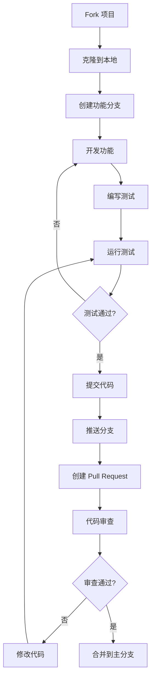

# 贡献指南

欢迎参与 Pot 项目的开发！本文档将指导您如何为项目做出贡献。

## 🎯 贡献方式

### 您可以通过以下方式贡献

-   🐛 **报告 Bug**: 发现问题并提交详细的错误报告
-   ✨ **提出功能建议**: 建议新功能或改进现有功能
-   💻 **代码贡献**: 修复 Bug、实现新功能、优化性能
-   📚 **文档改进**: 完善文档、添加示例、修正错误
-   🌍 **国际化**: 翻译界面文本到其他语言
-   🧪 **测试**: 编写测试用例、进行功能测试
-   🎨 **设计**: 改进 UI/UX 设计

## 🚀 快速开始

### 1. 准备工作

1. **Fork 项目**: 点击 GitHub 页面右上角的 "Fork" 按钮
2. **克隆代码**:
    ```bash
    git clone https://github.com/YOUR_USERNAME/pot-desktop.git
    cd pot-desktop
    ```
3. **添加上游仓库**:
    ```bash
    git remote add upstream https://github.com/pot-app/pot-desktop.git
    ```

### 2. 环境搭建

按照 [开发环境搭建指南](development-setup.md) 配置开发环境：

```bash
# 安装依赖
pnpm install

# 启动开发环境
pnpm tauri dev
```

### 3. 创建分支

```bash
# 同步最新代码
git fetch upstream
git checkout main
git merge upstream/main

# 创建功能分支
git checkout -b feature/your-feature-name
```

## 📋 贡献流程

### 完整的贡献流程



### 详细步骤

#### 1. 开发阶段

```bash
# 编写代码
# ... 进行开发工作 ...

# 运行格式化
pnpm format

# 运行代码检查
pnpm lint

# 运行测试
pnpm test

# 构建项目
pnpm build
```

#### 2. 提交代码

```bash
# 添加文件
git add .

# 提交代码（遵循提交规范）
git commit -m "feat: add new translation service"

# 推送分支
git push origin feature/your-feature-name
```

#### 3. 创建 Pull Request

1. 访问您的 Fork 仓库页面
2. 点击 "Compare & pull request" 按钮
3. 填写 PR 模板（见下文）
4. 提交 Pull Request

## 📝 提交规范

### Commit Message 格式

遵循 [Conventional Commits](https://www.conventionalcommits.org/) 规范：

```
<type>[optional scope]: <description>

[optional body]

[optional footer(s)]
```

#### 类型 (type)

| 类型       | 描述      | 示例                                           |
| ---------- | --------- | ---------------------------------------------- |
| `feat`     | 新功能    | `feat(translate): add DeepL support`           |
| `fix`      | 修复 Bug  | `fix(ocr): resolve memory leak issue`          |
| `docs`     | 文档变更  | `docs: update installation guide`              |
| `style`    | 代码格式  | `style: fix indentation in config`             |
| `refactor` | 重构      | `refactor(api): simplify error handling`       |
| `perf`     | 性能优化  | `perf(translate): cache translation results`   |
| `test`     | 测试      | `test(utils): add unit tests for string utils` |
| `chore`    | 构建/工具 | `chore: update dependencies`                   |

#### 作用域 (scope)

常用作用域：

-   `translate` - 翻译功能
-   `ocr` - 文字识别
-   `ui` - 用户界面
-   `config` - 配置管理
-   `api` - API 相关
-   `docs` - 文档
-   `test` - 测试
-   `build` - 构建系统

#### 示例

```bash
# 添加新功能
git commit -m "feat(translate): add support for custom API endpoints"

# 修复 Bug
git commit -m "fix(ocr): handle empty image data gracefully"

# 文档更新
git commit -m "docs(api): add examples for external API usage"

# 重大变更
git commit -m "feat!: migrate to new translation API

BREAKING CHANGE: The old translation API is no longer supported.
Please update your configuration to use the new API format."
```

## 🔍 Pull Request 指南

### PR 标题

PR 标题应该清晰描述变更内容：

```
feat: Add Google Translate integration
fix: Resolve memory leak in OCR service
docs: Update contributing guidelines
```

### PR 模板

创建 PR 时请填写以下模板：

```markdown
## 🎯 变更类型

-   [ ] 新功能 (feature)
-   [ ] Bug 修复 (fix)
-   [ ] 文档更新 (docs)
-   [ ] 代码重构 (refactor)
-   [ ] 性能优化 (perf)
-   [ ] 测试相关 (test)
-   [ ] 其他 (chore)

## 📝 变更描述

简要描述此次变更的内容和目的。

## 🔗 相关 Issue

-   Closes #123
-   Fixes #456
-   Related to #789

## 🧪 测试

-   [ ] 已添加单元测试
-   [ ] 已添加集成测试
-   [ ] 手动测试通过
-   [ ] 所有现有测试通过

## 📸 截图 (如适用)

如果是 UI 相关变更，请提供截图。

## ✅ 检查清单

-   [ ] 代码已格式化
-   [ ] 通过所有 lint 检查
-   [ ] 通过所有测试
-   [ ] 更新了相关文档
-   [ ] 遵循了代码规范
-   [ ] 添加了必要的注释

## 📋 其他说明

任何其他相关信息或需要注意的事项。
```

### PR 最佳实践

#### ✅ 好的 PR

-   **单一职责**: 每个 PR 只做一件事
-   **合适大小**: 变更行数控制在 400 行以内
-   **清晰描述**: 详细说明变更内容和原因
-   **完整测试**: 包含充分的测试用例
-   **及时响应**: 积极回应审查意见

#### ❌ 避免的做法

-   混合多种类型的变更
-   过大的 PR（超过 1000 行变更）
-   缺乏描述或测试
-   忽略审查意见
-   强制推送覆盖历史

## 🐛 Bug 报告

### 如何报告 Bug

1. **搜索现有 Issue**: 确保 Bug 未被报告过
2. **使用 Bug 模板**: 按照模板提供详细信息
3. **提供复现步骤**: 详细的复现步骤
4. **附加相关信息**: 日志、截图、系统信息

### Bug 报告模板

```markdown
## 🐛 Bug 描述

简要描述遇到的问题。

## 🔄 复现步骤

1. 打开应用
2. 点击翻译按钮
3. 输入文本 "Hello World"
4. 看到错误信息

## 🎯 预期行为

应该显示翻译结果。

## 📱 实际行为

显示了错误信息："Translation failed"。

## 🖥️ 环境信息

-   操作系统: macOS 13.0
-   Pot 版本: 3.0.7
-   系统架构: ARM64

## 📸 截图

如果适用，请添加截图。

## 📋 额外信息

-   错误日志
-   相关配置
-   其他相关信息
```

## ✨ 功能请求

### 如何提出功能建议

1. **搜索现有 Issue**: 确保功能未被建议过
2. **使用功能模板**: 按照模板详细描述
3. **说明使用场景**: 解释为什么需要这个功能
4. **考虑实现方案**: 如果可能，提供实现思路

### 功能请求模板

```markdown
## 🚀 功能描述

简要描述建议的功能。

## 🎯 问题背景

描述当前存在的问题或不便之处。

## 💡 建议的解决方案

详细描述您希望的功能实现。

## 🔄 使用场景

描述具体的使用场景和用户故事。

## 🎨 界面设计 (如适用)

如果涉及界面变更，请提供设计稿或描述。

## 📋 其他方案

是否考虑过其他解决方案？

## 📈 优先级

-   [ ] 高 - 影响核心功能
-   [ ] 中 - 改善用户体验
-   [ ] 低 - 锦上添花
```

## 🌍 国际化贡献

### 添加新语言

1. **复制语言文件**:

    ```bash
    cp src/i18n/locales/en_US.json src/i18n/locales/your_LOCALE.json
    ```

2. **翻译文本**: 翻译 JSON 文件中的所有文本

3. **添加语言选项**: 在配置中添加新语言选项

4. **测试翻译**: 确保翻译准确且界面正常

### 翻译指南

-   **保持格式**: 保留占位符和格式标记
-   **文化适应**: 考虑本地文化习惯
-   **简洁明了**: 保持文本简洁易懂
-   **一致性**: 保持术语翻译一致

## 🧪 测试贡献

### 测试类型

-   **单元测试**: 测试单个函数或组件
-   **集成测试**: 测试模块间的交互
-   **端到端测试**: 测试完整的用户流程
-   **性能测试**: 测试性能指标

### 编写测试

```javascript
// 单元测试示例
describe('translateText', () => {
    it('should translate text correctly', async () => {
        const result = await translateText('Hello', 'en', 'zh');
        expect(result).toBe('你好');
    });

    it('should handle empty input', async () => {
        await expect(translateText('', 'en', 'zh')).rejects.toThrow('Empty text');
    });
});
```

### 测试覆盖率

-   目标覆盖率: 80% 以上
-   关键功能: 100% 覆盖
-   运行覆盖率报告: `pnpm test:coverage`

## 👥 代码审查

### 作为贡献者

-   **响应及时**: 24-48 小时内回应审查意见
-   **接受建议**: 虚心接受审查意见
-   **详细解释**: 对争议点提供详细解释
-   **持续改进**: 根据反馈持续改进代码

### 审查清单

-   [ ] 代码逻辑正确
-   [ ] 遵循代码规范
-   [ ] 测试覆盖充分
-   [ ] 文档更新及时
-   [ ] 性能影响可接受
-   [ ] 安全性考虑
-   [ ] 向后兼容性

## 🏆 贡献者认可

### 贡献者类型

-   **核心贡献者**: 长期活跃的核心开发者
-   **功能贡献者**: 实现重要功能的开发者
-   **文档贡献者**: 完善文档的贡献者
-   **翻译贡献者**: 提供国际化支持的贡献者
-   **测试贡献者**: 改进测试覆盖率的贡献者

### 认可方式

-   **贡献者列表**: 在 README 中列出贡献者
-   **发布说明**: 在版本发布说明中感谢贡献者
-   **社区表彰**: 在社区中表彰突出贡献
-   **特殊权限**: 给予活跃贡献者更多权限

## 📞 获取帮助

### 沟通渠道

-   **GitHub Issues**: 报告问题和讨论功能
-   **GitHub Discussions**: 一般性讨论和问答
-   **QQ 频道**: [加入社区讨论](https://pd.qq.com/s/akns94e1r)

### 寻求帮助

如果您在贡献过程中遇到问题：

1. **查看文档**: 先查看相关文档和 FAQ
2. **搜索 Issues**: 搜索是否有类似问题
3. **提出问题**: 在 Discussions 中提问
4. **联系维护者**: 通过 Issue 或社区联系

### 帮助他人

-   回答新贡献者的问题
-   审查其他人的 Pull Request
-   改进文档和示例
-   分享使用经验

## 📋 贡献者协议

### 许可证

-   所有贡献将在 GPL-3.0 许可证下发布
-   确保您有权限贡献相关代码
-   不要包含受版权保护的第三方代码

### 行为准则

-   尊重他人，保持友善
-   建设性地提供反馈
-   欢迎新贡献者
-   遵守开源社区规范

### 知识产权

-   贡献者保留其贡献的版权
-   授予项目使用、修改、分发的权利
-   确保贡献不侵犯第三方权利

## 🎉 开始贡献

准备好开始贡献了吗？

1. **选择一个 Issue**: 从 [Good First Issue](https://github.com/pot-app/pot-desktop/labels/good%20first%20issue) 开始
2. **了解代码**: 阅读 [项目结构文档](project-structure.md)
3. **遵循规范**: 查看 [代码规范](coding-standards.md)
4. **开始编码**: 按照本指南开始您的第一个贡献

感谢您对 Pot 项目的贡献！每一个贡献都让项目变得更好。

---

_本文档会随着项目发展持续更新，欢迎提出改进建议。_
