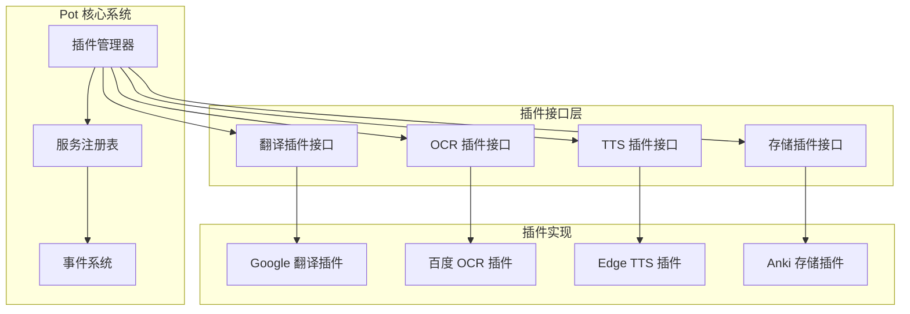

# 插件开发指南

本文档详细说明了 Pot 项目的插件系统架构、开发流程和最佳实践。

## 🔌 插件系统概览

### 插件架构



### 插件类型

| 插件类型     | 接口                | 功能描述       | 示例                  |
| ------------ | ------------------- | -------------- | --------------------- |
| **翻译插件** | `TranslationPlugin` | 文本翻译服务   | Google 翻译、百度翻译 |
| **OCR 插件** | `OcrPlugin`         | 图像文字识别   | 百度 OCR、腾讯 OCR    |
| **TTS 插件** | `TtsPlugin`         | 文字转语音     | Edge TTS、Azure TTS   |
| **存储插件** | `StoragePlugin`     | 数据存储和同步 | Anki 集成、欧路词典   |

## 🛠️ 插件开发

### 1. 翻译插件开发

#### 插件接口定义

```typescript
// src/types/plugins/translation.ts
export interface TranslationPlugin {
    /** 插件元信息 */
    manifest: PluginManifest;

    /** 翻译文本 */
    translate(params: TranslationParams): Promise<TranslationResult>;

    /** 获取支持的语言列表 */
    getSupportedLanguages(): Language[];

    /** 验证配置 */
    validateConfig(config: Record<string, any>): ValidationResult;

    /** 测试连接 */
    testConnection(config: Record<string, any>): Promise<TestResult>;
}

export interface TranslationParams {
    text: string;
    from: string;
    to: string;
    options?: Record<string, any>;
}

export interface TranslationResult {
    text: string;
    from: string;
    to: string;
    service: string;
    alternatives?: string[];
    confidence?: number;
    metadata?: Record<string, any>;
}
```

#### 翻译插件示例

**文件位置**: `src/services/translate/custom/index.jsx`

```javascript
import { invoke } from '@tauri-apps/api/tauri';

export default class CustomTranslationPlugin {
    constructor() {
        this.manifest = {
            name: 'custom-translate',
            version: '1.0.0',
            displayName: 'Custom Translation Service',
            description: '自定义翻译服务示例',
            author: 'Pot Team',
            homepage: 'https://github.com/pot-app/pot-desktop',
            supportedLanguages: ['en', 'zh', 'ja', 'ko'],
        };
    }

    async translate({ text, from, to, options = {} }) {
        try {
            // 验证输入
            if (!text || !text.trim()) {
                throw new Error('Text cannot be empty');
            }

            // 调用翻译 API
            const response = await this.callTranslationAPI({
                text: text.trim(),
                source: from,
                target: to,
                ...options,
            });

            return {
                text: response.translatedText,
                from: response.detectedLanguage || from,
                to,
                service: this.manifest.name,
                alternatives: response.alternatives,
                confidence: response.confidence,
            };
        } catch (error) {
            throw new Error(`Translation failed: ${error.message}`);
        }
    }

    getSupportedLanguages() {
        return [
            { code: 'en', name: 'English' },
            { code: 'zh', name: '中文' },
            { code: 'ja', name: '日本語' },
            { code: 'ko', name: '한국어' },
        ];
    }

    validateConfig(config) {
        const required = ['apiKey', 'endpoint'];
        const missing = required.filter((key) => !config[key]);

        return {
            isValid: missing.length === 0,
            errors: missing.map((key) => `Missing required field: ${key}`),
        };
    }

    async testConnection(config) {
        try {
            await this.callTranslationAPI(
                {
                    text: 'test',
                    source: 'en',
                    target: 'zh',
                },
                config
            );

            return { success: true, message: 'Connection successful' };
        } catch (error) {
            return { success: false, message: error.message };
        }
    }

    async callTranslationAPI(params, customConfig = null) {
        const config = customConfig || (await this.getConfig());

        const response = await fetch(config.endpoint, {
            method: 'POST',
            headers: {
                'Content-Type': 'application/json',
                Authorization: `Bearer ${config.apiKey}`,
            },
            body: JSON.stringify(params),
        });

        if (!response.ok) {
            throw new Error(`HTTP ${response.status}: ${response.statusText}`);
        }

        return await response.json();
    }

    async getConfig() {
        return await invoke('get_service_config', {
            service: this.manifest.name,
        });
    }
}
```

#### 配置界面组件

**文件位置**: `src/services/translate/custom/Config.jsx`

```javascript
import React, { useState, useEffect } from 'react';
import { Card, CardBody, Input, Button, Divider } from '@nextui-org/react';
import { useTranslation } from 'react-i18next';
import { MdCheck, MdError } from 'react-icons/md';

const CustomTranslateConfig = ({ config = {}, onConfigChange, onTest }) => {
    const { t } = useTranslation();
    const [formData, setFormData] = useState({
        apiKey: '',
        endpoint: 'https://api.example.com/translate',
        timeout: 30,
        ...config,
    });
    const [testResult, setTestResult] = useState(null);
    const [isTesting, setIsTesting] = useState(false);

    useEffect(() => {
        onConfigChange?.(formData);
    }, [formData, onConfigChange]);

    const handleInputChange = (field, value) => {
        setFormData((prev) => ({
            ...prev,
            [field]: value,
        }));
    };

    const handleTest = async () => {
        setIsTesting(true);
        setTestResult(null);

        try {
            const result = await onTest?.(formData);
            setTestResult(result);
        } catch (error) {
            setTestResult({
                success: false,
                message: error.message,
            });
        } finally {
            setIsTesting(false);
        }
    };

    return (
        <Card>
            <CardBody className='space-y-4'>
                <div className='space-y-4'>
                    <Input
                        label={t('service.custom_translate.api_key')}
                        placeholder='Enter your API key'
                        value={formData.apiKey}
                        onValueChange={(value) => handleInputChange('apiKey', value)}
                        type='password'
                        isRequired
                    />

                    <Input
                        label={t('service.custom_translate.endpoint')}
                        placeholder='https://api.example.com/translate'
                        value={formData.endpoint}
                        onValueChange={(value) => handleInputChange('endpoint', value)}
                        isRequired
                    />

                    <Input
                        label={t('service.custom_translate.timeout')}
                        placeholder='30'
                        value={formData.timeout.toString()}
                        onValueChange={(value) => handleInputChange('timeout', parseInt(value) || 30)}
                        type='number'
                        endContent={<span className='text-sm text-gray-500'>seconds</span>}
                    />
                </div>

                <Divider />

                <div className='flex items-center justify-between'>
                    <Button
                        color='primary'
                        variant='flat'
                        isLoading={isTesting}
                        onPress={handleTest}
                        isDisabled={!formData.apiKey || !formData.endpoint}
                    >
                        {isTesting ? t('service.testing') : t('service.test_connection')}
                    </Button>

                    {testResult && (
                        <div
                            className={cn(
                                'flex items-center gap-2 text-sm',
                                testResult.success ? 'text-success' : 'text-danger'
                            )}
                        >
                            {testResult.success ? <MdCheck /> : <MdError />}
                            <span>{testResult.message}</span>
                        </div>
                    )}
                </div>
            </CardBody>
        </Card>
    );
};

export default CustomTranslateConfig;
```

### 2. OCR 插件开发

#### OCR 插件接口

```typescript
// src/types/plugins/ocr.ts
export interface OcrPlugin {
    manifest: PluginManifest;
    recognize(params: OcrParams): Promise<OcrResult>;
    getSupportedLanguages(): Language[];
    validateConfig(config: Record<string, any>): ValidationResult;
    testConnection(config: Record<string, any>): Promise<TestResult>;
}

export interface OcrParams {
    image: ImageData | string; // base64 encoded image
    language?: string;
    options?: {
        detectOrientation?: boolean;
        recognizeTable?: boolean;
        outputFormat?: 'text' | 'json';
    };
}

export interface OcrResult {
    text: string;
    confidence: number;
    language: string;
    service: string;
    regions?: TextRegion[];
    metadata?: Record<string, any>;
}

export interface TextRegion {
    text: string;
    confidence: number;
    boundingBox: {
        x: number;
        y: number;
        width: number;
        height: number;
    };
}
```

#### OCR 插件示例

```javascript
// src/services/recognize/custom/index.jsx
export default class CustomOcrPlugin {
    constructor() {
        this.manifest = {
            name: 'custom-ocr',
            version: '1.0.0',
            displayName: 'Custom OCR Service',
            description: '自定义 OCR 服务示例',
            author: 'Pot Team',
            supportedLanguages: ['en', 'zh', 'ja'],
        };
    }

    async recognize({ image, language = 'auto', options = {} }) {
        try {
            // 预处理图像
            const processedImage = await this.preprocessImage(image);

            // 调用 OCR API
            const response = await this.callOcrAPI({
                image: processedImage,
                language,
                ...options,
            });

            // 后处理结果
            const result = this.postprocessResult(response);

            return {
                text: result.text,
                confidence: result.confidence,
                language: result.detectedLanguage || language,
                service: this.manifest.name,
                regions: result.regions,
                metadata: {
                    processingTime: result.processingTime,
                    imageSize: result.imageSize,
                },
            };
        } catch (error) {
            throw new Error(`OCR recognition failed: ${error.message}`);
        }
    }

    async preprocessImage(image) {
        // 图像预处理逻辑
        // - 调整尺寸
        // - 增强对比度
        // - 去噪
        return image;
    }

    postprocessResult(response) {
        // 结果后处理逻辑
        // - 文本清理
        // - 置信度计算
        // - 区域合并
        return response;
    }

    getSupportedLanguages() {
        return [
            { code: 'en', name: 'English' },
            { code: 'zh', name: '中文' },
            { code: 'ja', name: '日本語' },
        ];
    }

    validateConfig(config) {
        const required = ['apiKey', 'endpoint'];
        const missing = required.filter((key) => !config[key]);

        return {
            isValid: missing.length === 0,
            errors: missing.map((key) => `Missing required field: ${key}`),
        };
    }
}
```

### 3. TTS 插件开发

#### TTS 插件接口

```typescript
// src/types/plugins/tts.ts
export interface TtsPlugin {
    manifest: PluginManifest;
    speak(params: TtsParams): Promise<TtsResult>;
    getVoices(): Voice[];
    validateConfig(config: Record<string, any>): ValidationResult;
    testConnection(config: Record<string, any>): Promise<TestResult>;
}

export interface TtsParams {
    text: string;
    language: string;
    voice?: string;
    options?: {
        speed?: number;
        pitch?: number;
        volume?: number;
    };
}

export interface TtsResult {
    audioUrl?: string;
    audioData?: ArrayBuffer;
    duration?: number;
    service: string;
}

export interface Voice {
    id: string;
    name: string;
    language: string;
    gender: 'male' | 'female' | 'neutral';
    isDefault?: boolean;
}
```

#### TTS 插件示例

```javascript
// src/services/tts/custom/index.jsx
export default class CustomTtsPlugin {
    constructor() {
        this.manifest = {
            name: 'custom-tts',
            version: '1.0.0',
            displayName: 'Custom TTS Service',
            description: '自定义语音合成服务',
            author: 'Pot Team',
            supportedLanguages: ['en', 'zh', 'ja'],
        };
    }

    async speak({ text, language, voice, options = {} }) {
        try {
            const config = await this.getConfig();

            const response = await fetch(`${config.endpoint}/synthesize`, {
                method: 'POST',
                headers: {
                    'Content-Type': 'application/json',
                    Authorization: `Bearer ${config.apiKey}`,
                },
                body: JSON.stringify({
                    text,
                    language,
                    voice: voice || this.getDefaultVoice(language),
                    speed: options.speed || 1.0,
                    pitch: options.pitch || 1.0,
                    volume: options.volume || 1.0,
                }),
            });

            if (!response.ok) {
                throw new Error(`TTS request failed: ${response.statusText}`);
            }

            const audioData = await response.arrayBuffer();

            return {
                audioData,
                duration: this.calculateDuration(text),
                service: this.manifest.name,
            };
        } catch (error) {
            throw new Error(`TTS synthesis failed: ${error.message}`);
        }
    }

    getVoices() {
        return [
            {
                id: 'en-us-female-1',
                name: 'Emma (US English)',
                language: 'en',
                gender: 'female',
                isDefault: true,
            },
            {
                id: 'zh-cn-female-1',
                name: '小雅 (中文)',
                language: 'zh',
                gender: 'female',
                isDefault: true,
            },
        ];
    }

    getDefaultVoice(language) {
        const voices = this.getVoices();
        const defaultVoice = voices.find((v) => v.language === language && v.isDefault);
        return defaultVoice?.id || voices[0]?.id;
    }

    calculateDuration(text) {
        // 估算语音时长（字符数 / 每秒字符数）
        const wordsPerSecond = 2.5;
        const words = text.split(/\s+/).length;
        return Math.ceil(words / wordsPerSecond);
    }
}
```

### 4. 存储插件开发

#### 存储插件接口

```typescript
// src/types/plugins/storage.ts
export interface StoragePlugin {
    manifest: PluginManifest;
    save(data: StorageData): Promise<StorageResult>;
    load(query: StorageQuery): Promise<StorageData[]>;
    delete(id: string): Promise<boolean>;
    validateConfig(config: Record<string, any>): ValidationResult;
    testConnection(config: Record<string, any>): Promise<TestResult>;
}

export interface StorageData {
    id?: string;
    type: 'translation' | 'word' | 'phrase';
    content: {
        source: string;
        target: string;
        sourceLanguage: string;
        targetLanguage: string;
        context?: string;
        tags?: string[];
    };
    metadata?: Record<string, any>;
}
```

#### Anki 插件示例

```javascript
// src/services/collection/anki/index.jsx
export default class AnkiPlugin {
    constructor() {
        this.manifest = {
            name: 'anki',
            version: '1.0.0',
            displayName: 'Anki Integration',
            description: 'Export translations to Anki flashcards',
            author: 'Pot Team',
            homepage: 'https://apps.ankiweb.net/',
        };
    }

    async save(data) {
        try {
            const config = await this.getConfig();
            const note = this.createAnkiNote(data, config);

            const response = await this.callAnkiConnect('addNote', {
                note,
            });

            return {
                success: true,
                id: response.result,
                message: 'Successfully added to Anki',
            };
        } catch (error) {
            throw new Error(`Failed to save to Anki: ${error.message}`);
        }
    }

    createAnkiNote(data, config) {
        const { content } = data;

        return {
            deckName: config.deckName || 'Pot Translations',
            modelName: config.modelName || 'Basic',
            fields: {
                Front: content.source,
                Back: content.target,
                Context: content.context || '',
                'Source Language': content.sourceLanguage,
                'Target Language': content.targetLanguage,
            },
            tags: ['pot-app', ...(content.tags || [])],
        };
    }

    async callAnkiConnect(action, params = {}) {
        const config = await this.getConfig();

        const response = await fetch(`http://localhost:${config.port || 8765}`, {
            method: 'POST',
            headers: {
                'Content-Type': 'application/json',
            },
            body: JSON.stringify({
                action,
                version: 6,
                params,
            }),
        });

        if (!response.ok) {
            throw new Error('Failed to connect to Anki');
        }

        const result = await response.json();

        if (result.error) {
            throw new Error(result.error);
        }

        return result;
    }

    async testConnection(config) {
        try {
            await fetch(`http://localhost:${config.port || 8765}`, {
                method: 'POST',
                headers: {
                    'Content-Type': 'application/json',
                },
                body: JSON.stringify({
                    action: 'version',
                    version: 6,
                }),
            });

            return { success: true, message: 'Anki connection successful' };
        } catch (error) {
            return {
                success: false,
                message: 'Cannot connect to Anki. Please ensure AnkiConnect is installed and Anki is running.',
            };
        }
    }
}
```

## 📦 插件打包和分发

### 插件目录结构

```
custom-translation-plugin/
├── package.json              # 插件元信息
├── index.js                  # 插件入口文件
├── config.jsx               # 配置界面组件
├── icon.png                 # 插件图标
├── README.md                # 插件说明
├── LICENSE                  # 许可证
└── locales/                 # 国际化文件
    ├── en.json
    ├── zh.json
    └── ja.json
```

### 插件清单文件

**`package.json`**:

```json
{
    "name": "pot-plugin-custom-translate",
    "version": "1.0.0",
    "description": "Custom translation service plugin for Pot",
    "main": "index.js",
    "author": "Your Name <your.email@example.com>",
    "license": "MIT",
    "keywords": ["pot", "translation", "plugin"],
    "repository": {
        "type": "git",
        "url": "https://github.com/your-username/pot-plugin-custom-translate"
    },
    "pot": {
        "type": "translation",
        "displayName": "Custom Translation Service",
        "supportedLanguages": ["en", "zh", "ja", "ko"],
        "configComponent": "./config.jsx",
        "icon": "./icon.png",
        "minPotVersion": "3.0.0"
    },
    "dependencies": {},
    "peerDependencies": {
        "react": "^18.0.0"
    }
}
```

### 插件安装和管理

#### 插件安装

```bash
# 从 npm 安装
pot plugin install pot-plugin-custom-translate

# 从本地安装
pot plugin install ./custom-translation-plugin

# 从 URL 安装
pot plugin install https://github.com/user/plugin/archive/main.zip
```

#### 插件管理命令

```bash
# 列出已安装插件
pot plugin list

# 启用/禁用插件
pot plugin enable custom-translate
pot plugin disable custom-translate

# 更新插件
pot plugin update custom-translate

# 卸载插件
pot plugin uninstall custom-translate
```

## 🔧 插件开发工具

### 插件开发脚手架

```bash
# 创建插件模板
npx create-pot-plugin my-translation-plugin --type=translation

# 插件目录结构会自动生成
# 包含基础代码、配置文件和文档模板
```

### 开发环境设置

```javascript
// plugin-dev.config.js
export default {
    entry: './src/index.js',
    output: {
        path: './dist',
        filename: 'index.js',
        format: 'cjs',
    },
    external: ['react', 'react-dom', '@tauri-apps/api'],
    plugins: [
        // 插件构建配置
    ],
};
```

### 调试和测试

```javascript
// src/__tests__/plugin.test.js
import CustomTranslationPlugin from '../index';

describe('Custom Translation Plugin', () => {
    let plugin;

    beforeEach(() => {
        plugin = new CustomTranslationPlugin();
    });

    it('should have valid manifest', () => {
        expect(plugin.manifest.name).toBe('custom-translate');
        expect(plugin.manifest.version).toBeTruthy();
    });

    it('should validate config correctly', () => {
        const validConfig = {
            apiKey: 'test-key',
            endpoint: 'https://api.example.com',
        };

        const result = plugin.validateConfig(validConfig);
        expect(result.isValid).toBe(true);
    });

    it('should translate text', async () => {
        // Mock API response
        global.fetch = jest.fn().mockResolvedValue({
            ok: true,
            json: () =>
                Promise.resolve({
                    translatedText: '你好世界',
                    detectedLanguage: 'en',
                    confidence: 0.95,
                }),
        });

        const result = await plugin.translate({
            text: 'Hello World',
            from: 'en',
            to: 'zh',
        });

        expect(result.text).toBe('你好世界');
        expect(result.service).toBe('custom-translate');
    });
});
```

## 📋 插件开发检查清单

### 开发前准备

-   [ ] 确定插件类型和功能范围
-   [ ] 设计插件 API 接口
-   [ ] 准备测试数据和环境
-   [ ] 了解目标服务的 API 文档

### 开发过程

-   [ ] 实现核心功能接口
-   [ ] 添加配置验证逻辑
-   [ ] 实现错误处理机制
-   [ ] 添加连接测试功能
-   [ ] 编写配置界面组件
-   [ ] 添加国际化支持

### 测试验证

-   [ ] 编写单元测试
-   [ ] 进行集成测试
-   [ ] 测试错误场景
-   [ ] 验证配置界面
-   [ ] 测试多语言支持
-   [ ] 性能测试

### 发布准备

-   [ ] 完善插件文档
-   [ ] 准备示例和教程
-   [ ] 设置 CI/CD 流程
-   [ ] 准备发布说明
-   [ ] 提交到插件市场

## 🎨 插件 UI 开发

### 配置界面设计原则

1. **一致性**: 与主应用 UI 风格保持一致
2. **简洁性**: 只显示必要的配置选项
3. **可用性**: 提供清晰的帮助信息和验证反馈
4. **响应式**: 支持不同屏幕尺寸

### 配置组件模板

```javascript
// src/components/PluginConfig/index.jsx
import React from 'react';
import { Card, CardHeader, CardBody } from '@nextui-org/react';

const PluginConfig = ({ plugin, config, onConfigChange, onTest }) => {
    const ConfigComponent = plugin.configComponent;

    return (
        <Card>
            <CardHeader className='pb-2'>
                <div className='flex items-center gap-3'>
                    
                    <div>
                        <h3 className='text-lg font-semibold'>{plugin.manifest.displayName}</h3>
                        <p className='text-sm text-gray-600'>{plugin.manifest.description}</p>
                    </div>
                </div>
            </CardHeader>
            <CardBody>
                {ConfigComponent && (
                    <ConfigComponent
                        config={config}
                        onConfigChange={onConfigChange}
                        onTest={onTest}
                    />
                )}
            </CardBody>
        </Card>
    );
};

export default PluginConfig;
```

## 🔒 插件安全

### 安全考虑

1. **权限控制**: 插件只能访问授权的 API
2. **沙箱运行**: 插件在隔离环境中运行
3. **代码审查**: 插件代码需要审查
4. **签名验证**: 验证插件来源和完整性

### 安全实现

```rust
// src-tauri/src/plugin/security.rs
pub struct PluginSandbox {
    allowed_apis: HashSet<String>,
    rate_limiter: RateLimiter,
}

impl PluginSandbox {
    pub fn new(permissions: PluginPermissions) -> Self {
        Self {
            allowed_apis: permissions.apis,
            rate_limiter: RateLimiter::new(permissions.rate_limit),
        }
    }

    pub async fn execute_plugin_call(
        &self,
        plugin_id: &str,
        api_call: &str,
        params: serde_json::Value,
    ) -> Result<serde_json::Value, PluginError> {
        // 检查 API 权限
        if !self.allowed_apis.contains(api_call) {
            return Err(PluginError::PermissionDenied(api_call.to_string()));
        }

        // 检查调用频率
        if !self.rate_limiter.check_rate(plugin_id) {
            return Err(PluginError::RateLimitExceeded);
        }

        // 执行插件调用
        self.safe_execute(plugin_id, api_call, params).await
    }
}
```

## 📚 插件文档规范

### 插件 README 模板

```markdown
# Plugin Name

Brief description of the plugin functionality.

## Installation

\`\`\`bash
pot plugin install plugin-name
\`\`\`

## Configuration

1. Open Pot settings
2. Navigate to Service Management
3. Find the plugin in the list
4. Click Configure and fill in required fields:
    - API Key: Your service API key
    - Endpoint: Service endpoint URL

## Usage

The plugin will be automatically available after configuration.

## Supported Languages

-   English (en)
-   Chinese (zh)
-   Japanese (ja)

## API Reference

### Configuration Options

| Option   | Type   | Required | Description                    |
| -------- | ------ | -------- | ------------------------------ |
| apiKey   | string | Yes      | Your API key                   |
| endpoint | string | Yes      | Service endpoint               |
| timeout  | number | No       | Request timeout (default: 30s) |

## Troubleshooting

### Common Issues

**Connection Failed**

-   Verify API key is correct
-   Check endpoint URL
-   Ensure network connectivity

## License

MIT License
```

## 🔧 插件开发工具

### 插件测试工具

```javascript
// tools/plugin-tester.js
class PluginTester {
    constructor(plugin) {
        this.plugin = plugin;
    }

    async runAllTests() {
        const results = {
            manifest: this.testManifest(),
            config: await this.testConfig(),
            functionality: await this.testFunctionality(),
            performance: await this.testPerformance(),
        };

        return results;
    }

    testManifest() {
        const required = ['name', 'version', 'displayName', 'description'];
        const missing = required.filter((field) => !this.plugin.manifest[field]);

        return {
            passed: missing.length === 0,
            errors: missing.map((field) => `Missing required field: ${field}`),
        };
    }

    async testConfig() {
        const testConfigs = [
            {}, // 空配置
            { apiKey: 'invalid' }, // 无效配置
            { apiKey: 'valid', endpoint: 'https://api.example.com' }, // 有效配置
        ];

        const results = [];
        for (const config of testConfigs) {
            const result = this.plugin.validateConfig(config);
            results.push({ config, result });
        }

        return results;
    }

    async testFunctionality() {
        // 测试核心功能
        const testCases = [
            { text: 'Hello', from: 'en', to: 'zh' },
            { text: '你好', from: 'zh', to: 'en' },
            { text: '', from: 'en', to: 'zh' }, // 边界情况
        ];

        const results = [];
        for (const testCase of testCases) {
            try {
                const result = await this.plugin.translate(testCase);
                results.push({ testCase, result, success: true });
            } catch (error) {
                results.push({ testCase, error: error.message, success: false });
            }
        }

        return results;
    }
}
```

## 📚 相关文档

-   [API 文档](../api/plugin-api.md) - 详细的插件 API 参考
-   [架构设计](architecture.md) - 插件系统架构设计
-   [代码规范](coding-standards.md) - 插件代码规范
-   [测试指南](testing.md) - 插件测试最佳实践

---

_插件开发指南会随着插件系统的发展持续更新，欢迎贡献新的插件和改进建议。_
