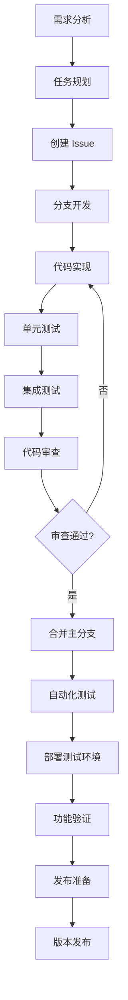

# 开发流程

本文档详细说明了 Pot 项目的开发流程、分支管理策略和发布流程。

## 🔄 开发生命周期概览



## 🌳 分支管理策略

### 分支类型

我们采用 **Git Flow** 分支管理策略：

#### 主要分支

1. **`main`** - 生产分支

    - 始终保持稳定可发布状态
    - 只接受来自 `release` 和 `hotfix` 分支的合并
    - 每次合并都会触发自动发布

2. **`develop`** - 开发分支
    - 集成所有新功能
    - 功能开发的基础分支
    - 定期合并到 `release` 分支

#### 辅助分支

3. **`feature/*`** - 功能分支

    - 从 `develop` 分支创建
    - 开发新功能或改进
    - 完成后合并回 `develop`

4. **`release/*`** - 发布分支

    - 从 `develop` 分支创建
    - 准备新版本发布
    - 只允许 bug 修复和版本号更新

5. **`hotfix/*`** - 热修复分支
    - 从 `main` 分支创建
    - 修复生产环境紧急问题
    - 同时合并到 `main` 和 `develop`

### 分支命名规范

```bash
# 功能分支
feature/user-authentication
feature/google-translate-integration
feature/dark-mode-support

# 发布分支
release/v3.1.0
release/v3.1.1

# 热修复分支
hotfix/critical-memory-leak
hotfix/translation-api-timeout

# 其他分支
bugfix/fix-ocr-accuracy
docs/update-installation-guide
refactor/simplify-api-client
```

## 📋 开发工作流程

### 1. 需求分析和任务规划

#### 需求来源

-   用户反馈和建议
-   GitHub Issues
-   项目路线图
-   性能优化需求
-   安全性改进

#### 任务分类

-   **Epic**: 大型功能或重构项目
-   **Story**: 用户故事和功能需求
-   **Task**: 技术任务和改进
-   **Bug**: 缺陷修复
-   **Spike**: 技术调研

### 2. Issue 管理

#### Issue 模板

**功能请求模板**:

```markdown
## 功能描述

简要描述建议的功能。

## 用户价值

说明这个功能对用户的价值。

## 实现方案

-   [ ] 前端界面设计
-   [ ] 后端 API 实现
-   [ ] 数据库设计
-   [ ] 测试用例

## 验收标准

-   [ ] 功能正常工作
-   [ ] 性能满足要求
-   [ ] 通过所有测试
-   [ ] 文档已更新

## 优先级

-   [ ] P0 - 紧急
-   [ ] P1 - 高
-   [ ] P2 - 中
-   [ ] P3 - 低

## 工作量估算

预计需要 X 个工作日
```

#### Issue 标签系统

| 标签                  | 颜色    | 描述         |
| --------------------- | ------- | ------------ |
| `bug`                 | #d73a49 | 软件缺陷     |
| `feature`             | #a2eeef | 新功能请求   |
| `enhancement`         | #a2eeef | 功能改进     |
| `documentation`       | #0075ca | 文档相关     |
| `good first issue`    | #7057ff | 适合新贡献者 |
| `help wanted`         | #008672 | 需要帮助     |
| `priority: high`      | #d93f0b | 高优先级     |
| `priority: low`       | #0e8a16 | 低优先级     |
| `status: in progress` | #fbca04 | 进行中       |
| `status: blocked`     | #b60205 | 被阻塞       |

### 3. 功能开发流程

#### 开发前准备

1. **同步最新代码**:

    ```bash
    git checkout develop
    git pull upstream develop
    ```

2. **创建功能分支**:

    ```bash
    git checkout -b feature/new-translation-service
    ```

3. **设置开发环境**:
    ```bash
    pnpm install
    pnpm tauri dev
    ```

#### 开发过程

1. **编写代码**:

    - 遵循 [代码规范](coding-standards.md)
    - 使用 TDD (测试驱动开发) 方法
    - 及时提交小的变更

2. **提交规范**:

    ```bash
    # 遵循 Conventional Commits
    git commit -m "feat(translate): add DeepL translation service

    - Add DeepL API client
    - Implement translation method
    - Add error handling
    - Update service registry

    Closes #123"
    ```

3. **定期同步**:
    ```bash
    # 定期同步 develop 分支
    git fetch upstream
    git rebase upstream/develop
    ```

#### 开发完成

1. **自测检查**:

    ```bash
    # 运行所有检查
    pnpm format:check
    pnpm lint
    pnpm type-check
    pnpm test
    pnpm build
    ```

2. **推送分支**:

    ```bash
    git push origin feature/new-translation-service
    ```

3. **创建 Pull Request**:
    - 填写详细的 PR 描述
    - 关联相关 Issue
    - 请求代码审查

### 4. 代码审查流程

#### 审查准备

1. **自动化检查**:

    - CI/CD 管道自动运行
    - 代码格式检查
    - 单元测试
    - 集成测试
    - 安全扫描

2. **审查分配**:
    - 至少需要 2 个审查者
    - 包含 1 个核心维护者
    - 相关领域的专家

#### 审查标准

**代码质量**:

-   [ ] 代码逻辑正确
-   [ ] 遵循项目规范
-   [ ] 性能影响可接受
-   [ ] 安全性考虑充分

**测试覆盖**:

-   [ ] 单元测试充分
-   [ ] 集成测试覆盖
-   [ ] 边界条件测试
-   [ ] 错误处理测试

**文档完整**:

-   [ ] 代码注释清晰
-   [ ] API 文档更新
-   [ ] 用户文档更新
-   [ ] 变更日志记录

#### 审查流程

1. **初步审查**:

    - 检查 PR 描述完整性
    - 验证关联 Issue
    - 确认分支策略正确

2. **代码审查**:

    - 逐行代码审查
    - 架构和设计审查
    - 性能和安全审查

3. **测试验证**:

    - 本地功能测试
    - 自动化测试验证
    - 回归测试检查

4. **反馈处理**:
    - 提供具体改进建议
    - 解释审查意见
    - 协助解决问题

### 5. 合并和集成

#### 合并条件

-   [ ] 所有自动化检查通过
-   [ ] 至少 2 个审查者批准
-   [ ] 解决所有审查意见
-   [ ] 没有合并冲突
-   [ ] 相关文档已更新

#### 合并策略

1. **功能分支合并**:

    ```bash
    # 使用 Squash and Merge
    git checkout develop
    git merge --squash feature/new-translation-service
    git commit -m "feat(translate): add DeepL translation service (#123)"
    ```

2. **发布分支合并**:
    ```bash
    # 使用 Merge Commit
    git checkout main
    git merge --no-ff release/v3.1.0
    git tag v3.1.0
    ```

## 🚀 发布流程

### 版本号规范

遵循 [语义化版本](https://semver.org/) (SemVer):

```
MAJOR.MINOR.PATCH[-PRE_RELEASE][+BUILD_METADATA]

例如:
- 3.1.0      # 正式版本
- 3.1.0-rc.1 # 候选版本
- 3.1.0-beta.2 # 测试版本
- 3.1.0-alpha.1 # 内测版本
```

#### 版本类型

-   **MAJOR**: 不兼容的 API 变更
-   **MINOR**: 向后兼容的功能新增
-   **PATCH**: 向后兼容的问题修复

### 发布类型

#### 1. 常规发布 (Regular Release)

**发布周期**: 每 4-6 周

**流程**:

1. **创建发布分支**:

    ```bash
    git checkout develop
    git checkout -b release/v3.1.0
    ```

2. **版本号更新**:

    ```bash
    # 更新 package.json
    npm version 3.1.0

    # 更新 Cargo.toml
    # 更新文档中的版本号
    ```

3. **发布候选版本**:

    ```bash
    git tag v3.1.0-rc.1
    git push origin v3.1.0-rc.1
    ```

4. **测试验证**:

    - 自动化测试
    - 手动功能测试
    - 性能测试
    - 兼容性测试

5. **正式发布**:
    ```bash
    git checkout main
    git merge --no-ff release/v3.1.0
    git tag v3.1.0
    git push origin main --tags
    ```

#### 2. 热修复发布 (Hotfix Release)

**触发条件**: 生产环境严重问题

**流程**:

1. **创建热修复分支**:

    ```bash
    git checkout main
    git checkout -b hotfix/v3.0.8
    ```

2. **修复问题**:

    ```bash
    # 实现修复
    git commit -m "fix: resolve critical memory leak"
    ```

3. **版本号更新**:

    ```bash
    npm version patch
    ```

4. **合并到主分支**:

    ```bash
    git checkout main
    git merge --no-ff hotfix/v3.0.8
    git tag v3.0.8
    ```

5. **同步到开发分支**:
    ```bash
    git checkout develop
    git merge hotfix/v3.0.8
    ```

### 发布检查清单

#### 发布前检查

-   [ ] 所有目标功能已完成
-   [ ] 所有已知 Bug 已修复
-   [ ] 性能测试通过
-   [ ] 安全扫描通过
-   [ ] 文档已更新
-   [ ] 变更日志已准备
-   [ ] 发布说明已准备

#### 发布过程检查

-   [ ] 版本号正确更新
-   [ ] Git 标签已创建
-   [ ] CI/CD 构建成功
-   [ ] 所有平台构建完成
-   [ ] 安装包已生成
-   [ ] 签名验证通过

#### 发布后检查

-   [ ] 发布说明已发布
-   [ ] 下载链接正常
-   [ ] 自动更新功能正常
-   [ ] 监控系统正常
-   [ ] 用户反馈收集

## 🔧 自动化工具

### CI/CD 管道

#### GitHub Actions 工作流

```yaml
# .github/workflows/ci.yml
name: CI/CD Pipeline

on:
    push:
        branches: [main, develop]
    pull_request:
        branches: [main, develop]

jobs:
    test:
        runs-on: ubuntu-latest
        steps:
            - uses: actions/checkout@v3
            - uses: actions/setup-node@v3
              with:
                  node-version: 18
                  cache: 'pnpm'

            - name: Install dependencies
              run: pnpm install

            - name: Run linting
              run: pnpm lint

            - name: Run tests
              run: pnpm test:coverage

            - name: Upload coverage
              uses: codecov/codecov-action@v3

    build:
        needs: test
        strategy:
            matrix:
                os: [ubuntu-latest, windows-latest, macos-latest]
        runs-on: ${{ matrix.os }}
        steps:
            - uses: actions/checkout@v3
            - name: Build application
              run: pnpm tauri build

    release:
        if: startsWith(github.ref, 'refs/tags/v')
        needs: [test, build]
        runs-on: ubuntu-latest
        steps:
            - name: Create Release
              uses: actions/create-release@v1
              with:
                  tag_name: ${{ github.ref }}
                  release_name: Release ${{ github.ref }}
```

### 自动化脚本

#### 版本发布脚本

```bash
#!/bin/bash
# scripts/release.sh

set -e

VERSION=$1
if [ -z "$VERSION" ]; then
  echo "Usage: $0 <version>"
  exit 1
fi

echo "🚀 Starting release process for version $VERSION"

# 1. 检查工作目录是否干净
if [ -n "$(git status --porcelain)" ]; then
  echo "❌ Working directory is not clean"
  exit 1
fi

# 2. 同步最新代码
git fetch upstream
git checkout develop
git merge upstream/develop

# 3. 运行测试
echo "🧪 Running tests..."
pnpm test

# 4. 创建发布分支
git checkout -b "release/v$VERSION"

# 5. 更新版本号
echo "📝 Updating version numbers..."
npm version "$VERSION" --no-git-tag-version
cd src-tauri
cargo set-version "$VERSION"
cd ..

# 6. 更新变更日志
echo "📋 Updating CHANGELOG..."
# 这里可以集成自动生成变更日志的工具

# 7. 提交变更
git add .
git commit -m "chore: bump version to $VERSION"

# 8. 推送分支
git push origin "release/v$VERSION"

echo "✅ Release branch created successfully"
echo "👉 Next steps:"
echo "   1. Create PR to merge release branch to main"
echo "   2. After PR approval, create release tag"
echo "   3. Publish release notes"
```

#### 依赖更新脚本

```bash
#!/bin/bash
# scripts/update-deps.sh

echo "📦 Updating dependencies..."

# 更新 Node.js 依赖
pnpm update

# 更新 Rust 依赖
cd src-tauri
cargo update
cd ..

# 运行测试确保更新没有破坏功能
echo "🧪 Running tests after update..."
pnpm test

# 检查是否有安全漏洞
pnpm audit
cd src-tauri
cargo audit
cd ..

echo "✅ Dependencies updated successfully"
```

## 📊 质量保证

### 代码质量指标

#### 覆盖率要求

-   **单元测试覆盖率**: ≥ 80%
-   **集成测试覆盖率**: ≥ 60%
-   **关键路径覆盖率**: 100%

#### 性能指标

-   **应用启动时间**: < 3 秒
-   **翻译响应时间**: < 2 秒
-   **OCR 识别时间**: < 5 秒
-   **内存使用**: < 200MB

#### 代码质量

-   **圈复杂度**: < 10
-   **函数长度**: < 50 行
-   **文件长度**: < 500 行
-   **重复代码**: < 5%

### 质量门禁

#### 提交门禁

```bash
# .husky/pre-commit
#!/bin/sh
. "$(dirname "$0")/_/husky.sh"

echo "🔍 Running pre-commit checks..."

# 代码格式检查
pnpm format:check

# 代码质量检查
pnpm lint

# 类型检查
pnpm type-check

# 单元测试
pnpm test:unit

echo "✅ All pre-commit checks passed"
```

#### 合并门禁

-   [ ] 所有 CI 检查通过
-   [ ] 代码覆盖率达标
-   [ ] 性能测试通过
-   [ ] 安全扫描通过
-   [ ] 至少 2 个审查者批准

## 🔄 持续改进

### 流程评估

#### 定期回顾

-   **Sprint 回顾**: 每 2 周
-   **季度回顾**: 每 3 个月
-   **年度回顾**: 每年

#### 评估指标

-   **开发效率**: 功能交付速度
-   **代码质量**: Bug 率和技术债务
-   **团队满意度**: 开发体验调查
-   **用户满意度**: 用户反馈和评分

### 流程优化

#### 识别瓶颈

1. **代码审查延迟**

    - 设置审查时间限制
    - 增加审查者数量
    - 使用自动化工具

2. **测试执行时间长**

    - 并行化测试执行
    - 优化测试用例
    - 使用测试缓存

3. **构建时间长**
    - 优化构建配置
    - 使用构建缓存
    - 增量构建

#### 工具改进

-   **自动化程度提升**: 减少手动操作
-   **工具集成**: 统一开发环境
-   **监控完善**: 实时质量监控
-   **文档自动化**: 自动生成文档

## 📞 支持和帮助

### 开发支持

-   **技术讨论**: GitHub Discussions
-   **实时沟通**: QQ 频道
-   **问题报告**: GitHub Issues
-   **文档问题**: 直接提交 PR

### 培训资源

-   **新人指南**: [贡献指南](contributing.md)
-   **代码规范**: [代码规范](coding-standards.md)
-   **测试指南**: [测试指南](testing.md)
-   **最佳实践**: 项目 Wiki

---

_开发流程会根据项目发展和团队反馈持续优化，欢迎提出改进建议。_
